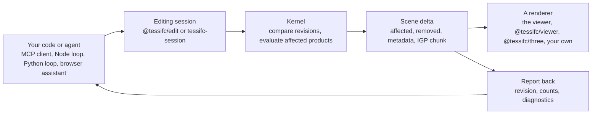

<!-- SPDX-License-Identifier: Apache-2.0 -->
# Agents and pipelines

This page is for anyone who wants an agent, a script or another program to
edit or create IFC models and watch the result: an agent proposes a change,
TessIFC works out which products that touched, re-tessellates only those and
hands back a delta that a renderer applies. Nothing here needs the reference
viewer, but the viewer follows every route on this page.

## The loop



Three things hold the loop together:

1. **The session owns the committed revision.** Every change is staged as a
   candidate, evaluated, checked, and only then committed. A failed script,
   a rejected snapshot or unacceptable geometry leaves the previous revision
   in place. Undo and redo are new revisions, never a rewind of the scene.
2. **The kernel decides the affected set.** Scripts and agents say what they
   want to change; the comparison of the old and new model, with its
   dependency rules for openings, shared representations, placements, styles
   and materials, says what has to be rebuilt. A rename rebuilds nothing.
3. **The delta is the contract.** Whatever produced it, the renderer applies
   the same object: products to retire, an IGP chunk with their replacements,
   and the new hierarchy. Report the kernel's numbers, not the agent's prose.

## Choose an entry point

| You have | Use | What runs where |
|---|---|---|
| Claude Code, Claude Desktop or any MCP client | `@tessifc/mcp` (`bindings/mcp`) | The kernel in a Node process; scripts in JavaScript; the viewer follows on loopback |
| The same, with IfcOpenShell | `tessifc-session --mcp` (`adapters/ifcopenshell`) | Scripts in Python against IfcOpenShell; the same tools; the viewer follows the file |
| A Node or browser program with the kernel | `createEditingSession`, `createAgentTools`, `runAgentTurn` from `@tessifc/edit` | Your loop, your provider, deltas in memory |
| A three.js scene | `createRetainedModel` from `@tessifc/three` | Applies deltas mesh by mesh |
| A page of your own | `createViewer` from `@tessifc/viewer` | `applyDelta` and `follow` put a session on screen |
| Any process that can write a file | Save the IFC, let a session or the viewer ingest it | Snapshot comparison, no instrumentation needed |

## An agent over MCP

`@tessifc/mcp` is a Model Context Protocol server on stdio. It holds one model
in its own kernel, saves the file after every accepted edit, and serves the
viewer at a loopback address so a person can watch the agent work. From a
checkout, after `python scripts/build-wasm.py --target both`:

```sh
npm ci
claude mcp add tessifc -- node bindings/mcp/src/cli.js --new house.ifc
```

Start a conversation and ask for a building; the server prints
`Viewer: http://127.0.0.1:8000/viewer/?session=file` on stderr, and that page
shows every revision as it is committed. `--new` starts from a project, site,
building and storeys (`--schema`, `--units`, `--storeys "Ground floor:0,Upper floor:3"`);
without it the server opens an existing file. For Claude Desktop, put the
same command in `claude_desktop_config.json`:

```json
{
  "mcpServers": {
    "tessifc": { "command": "node", "args": ["<checkout>/bindings/mcp/src/cli.js", "--new", "house.ifc"] }
  }
}
```

The Python server registers the same way and offers the same tools, with
scripts in Python against an installed IfcOpenShell:

```sh
pip install -e "adapters/ifcopenshell[authoring,mcp]"
claude mcp add tessifc-py -- python scripts/serve-edit-session.py house.ifc --mcp --new
```

### The tools

Both servers implement one contract (`bindings/mcp/contract.json`, asserted by
both test suites). Every result is JSON; the editing tools also return it as
structured content.

| Tool | Input | Result | Python |
|---|---|---|---|
| `describe_model` | | `name`, `schema`, `revision`, `version`, `lengthUnit`, `products` by class, `storeys`, `history`, `viewer`, `text` (a prompt-ready summary) | yes |
| `find_products` | `class`, `name`, `storey`, `limit` | `products` (`id`, `class`, `name`, `guid`, `storey`), `total` | yes |
| `product_info` | `id` or `guid` | `id`, `class`, `guid`, `name`, `attributes`, `container`, `propertySets`, `representations`, `placement` | yes |
| `inspect_model` | `code` | `ok`, `timedOut`, `stdout`, `error`, `traceback`; a read-only run, nothing is published | yes |
| `edit_model` | `script`, `summary` | `ok`, `timedOut`, `changed`, `revision`, `version`, `stdout`, `operations`, `affectedProducts`, `removedProducts`, `metadataProducts`, `fullRebuild`, `diagnostics`, `history`, `saved` | yes |
| `undo`, `redo` | | as `edit_model`, plus `label` | yes |
| `export_model` | `path` | `path`, `bytes`, `version` | yes |
| `new_model` | `schema`, `name`, `units`, `site`, `building`, `storeys`, `path`, `force` | `revision`, `version`, `generation`, `storeys`, `products` | yes |
| `open_model` | `path` | `revision`, `version`, `generation`, `products` | yes |
| `get_selection` | | `ids`, `guids`, `className`, `name`, `reportedAt`: what the person clicked in the viewer | yes |
| `verify_revision` | | `ok`, `revision`, `products`, `mismatches`: a fresh evaluation of the exported file against the scene built from the deltas | Node only |
| `list_examples` | | `examples` (`title`, `source`), including a small house | yes |

Resources: `tessifc://script-api` (the script names for the language of the
server) and `tessifc://model/summary`. Prompt: `build-a-building`, the brief
the demo uses: describe the model, then one `edit_model` per step, check
`affectedProducts` after each, finish with `verify_revision`.

A script that throws is an error result with the traceback and the model is
unchanged. A candidate the kernel refuses is an error result with the
diagnostics, and the committed model is unchanged. A second script while one
is running is refused. In Python, `affectedProducts` and `fullRebuild` come
from the viewer's applied report, so they are `null` with a note when no
viewer is attached; the Node server computes them itself.

### The viewer follows

The viewer page at the printed address follows the session: it opens the
model at its first revision (an empty one shows "Empty model: no product
geometry yet"), applies every later version as a delta, reports each revision
with the kernel's affected-product count, and posts the selection back so
`get_selection` answers the agent. Its Session panel runs scripts on the same
host, with the host's examples, and its own undo and redo are the host's.
The same protocol drives `createViewer(...).follow()` in a page of your own;
`examples/embed-viewer/` has the button.

## The Node SDK loop

Everything the MCP server does is available as functions from `@tessifc/edit`
for a loop you already have. `examples/agent-building/` is the complete
version of this sketch: it builds a two-storey house step by step with a
provider of your choice, and `build-house.mjs` runs the same steps without a
model at all.

```js
import { Kernel } from "@tessifc/core/node";
import { createEditingSession, createModel, describeModel, createAgentTools, runAgentTurn,
         chatCompletions, createSceneMirror, verifyRevision } from "@tessifc/edit";

const kernel = new Kernel();
const id = kernel.openModel(createModel({ schema: "IFC4", name: "House",
  storeys: [{ name: "Ground floor", elevation: 0 }, { name: "Upper floor", elevation: 3 }] }));
const session = createEditingSession(kernel, id, { settings: { includeOpenings: true } });
const mirror = createSceneMirror(session.evaluate().pack);          // the scene, as a renderer would keep it

const complete = chatCompletions({ baseUrl: "https://openrouter.ai/api/v1", key: process.env.OPENROUTER_API_KEY, model: "..." });
const tools = createAgentTools(session, { policy: "auto", onDelta: (delta) => mirror.applyDelta(delta) });

const turn = await runAgentTurn({
  complete, tools, mode: "edit",
  prompt: "Add the four exterior walls of a ten by eight metre house on the ground floor.",
  context: describeModel(session),
  onEvent: (event) => { if (event.type === "delta") console.log(event.delta.revision, event.delta.affectedProducts); },
});
console.log(turn.answer, turn.usage, turn.rounds);
console.log(verifyRevision({ Kernel, session, mirror }).ok);          // the deltas agree with a fresh evaluation
```

The pieces:

* **`createModel(options)`** writes a minimal IFC file: header, units (`m` or
  `mm`), the geometric context, a project, site, building and storeys, and in
  IFC2X3 the owner history every rooted record needs. The session starts
  empty and the first script publishes a normal selective delta.
* **Building helpers** in the script API (`ifc.addWall`, `addSlab`,
  `addDoor`, `addWindow`, `addColumn`, `addBeam`, `addStorey`,
  `addProperties`, `setColor`, `storeys`, `byName`, `describe`) make a
  building a handful of scripts. They are documented with the rest of the
  script API in the [SDK](sdk.md#browser-scripts).
* **`describeModel(session, { selection })`** builds the context the agent
  reads: file, schema, revision, unit, product counts by class, storeys and
  the selection with its attributes. `describeModelInfo(data)` formats the
  same text from data you already have.
* **`createAgentTools(session, { policy, selection, onDelta, maxProposalsPerTurn })`**
  executes the three tools (`inspect_model`, `propose_edit`, `undo_edit`)
  against a session. With `policy: "review"` a proposal is recorded and you
  run it with `tools.run(proposal)` after a look; with `auto` it runs at once
  and `onDelta` receives the delta. One proposal per turn is the default.
* **`runAgentTurn({ complete, tools, prompt, mode, context, history, maxRounds, signal, onEvent })`**
  is the tool-use loop: it calls `complete` until the model answers, feeds
  tool results back, sums token `usage`, stops on an `AbortSignal`, and
  reports `round`, `tool`, `proposal`, `delta` and `answer` events. It returns
  `answer`, `proposals` (each with the script, the summary and, when run, the
  kernel's report), `usage`, `rounds` and `stop`.
* **Providers.** `chatCompletions({ baseUrl, key, model })` speaks the
  chat-completions wire format (OpenRouter, OpenAI-compatible servers, Ollama,
  LM Studio); `anthropicMessages({ key, model, thinking, effort })` speaks the
  Messages API. Both return a `complete` function and take a `fetch` of your
  own. The pure `encode*` and `decode*` helpers are exported for any other
  transport, and `toMessagesTools` and `toChatTools` map the tool
  definitions.
* **Verification.** `createSceneMirror(pack)` keeps the scene a renderer
  would keep, product by product, and `verifyRevision({ Kernel, session, mirror })`
  compares it with a fresh evaluation of the exported file, triangle by
  triangle. `ok: false` lists the mismatched products.

The session's delta is the same object everywhere: `kind` (`selective`,
`full`, `direct`), `revision`, `affectedProducts`, `removedProducts`,
`metadataProducts`, the IGP `chunk` and its parsed `pack`, `hierarchy`,
`impact` and `timings`. Apply `full` by rebuilding the scene from `pack`;
apply the others by retiring the affected and removed products and adding
every instance in `pack`.

## The browser assistant

The reference viewer's Assistant tab is one client of the same functions:
`createBrowserAssistant` in `viewer/src/assistant.js` wraps the page's
inspect, execute and undo callbacks as a tools host and calls
`runAgentTurn` with the provider adapters above, so a fix in the package
reaches the page. Choose the provider under **Settings > Assistant**; the key
stays in the browser. While a session host is attached (`?session=file`),
scripts and the assistant run on the host instead.

## Python and IfcOpenShell

`tessifc-session` owns one IFC file, runs Python scripts against it with an
installed IfcOpenShell inside a transaction, saves each accepted change
atomically and publishes it to the viewer. `--mcp` puts the tools above on
stdio and keeps the viewer server running in the same process; `--new`
creates the file first. Scripts see `model`, `ifcopenshell`, `api`,
`element`, `guid`, `selection` and `selected`, and in IFC2X3 the API's owner
history hooks are set for the duration of every script.

```python
from tessifc_session import Assistant, EditSession
from tessifc_session.model import create_model, write_model

write_model(create_model("IFC4", name="House", storeys=[{"name": "Ground floor", "elevation": 0.0}]), "house.ifc")
session = EditSession("house.ifc")
result = session.run_script("""
wall = api.run("root.create_entity", model, ifc_class="IfcWall", name="South wall")
api.run("spatial.assign_container", model, products=[wall], relating_structure=model.by_type("IfcBuildingStorey")[0])
""")
print(result["ok"], result["operations"], result["revision"])
```

`Assistant(session, provider)` runs the same loop with any provider object
whose `complete(system=, tools=, messages=)` returns a Messages-API-shaped
response; `INSPECT_TOOL`, `PROPOSE_TOOL` and `UNDO_TOOL` are the definitions
for a loop of your own. `examples/agent-building/build_house.py` builds the
demo house with `ifcopenshell.api`, saving after every step so the viewer
follows.

## Verifying an edit

A visually plausible frame is not a proof. After each delta, check the
numbers the session gives you:

* `affectedProducts` and `removedProducts` match the intent (a rename
  affects nothing; a moved opening affects the host too; a door affects the
  wall, the opening and the door).
* `operations` counts the records the script created, modified and deleted,
  and `error` is null.
* `impact.productOutcomes` and `diagnostics` name products with no usable
  geometry; `kernel.getProductOutcomes` does the same for the whole model.
* Independent check: `verify_revision` over MCP or `verifyRevision` in Node
  evaluates the exported file from scratch and compares per-product
  triangles with the scene built from the deltas. Reopen the exported file
  with any IFC tool for a second opinion.

## Boundaries

Scripts run with your program's permissions and without a sandbox, in the
browser worker, the MCP process or the session process. Review generated
scripts before granting an agent automatic edits, and keep provider keys out
of anything a script can read. The browser viewer and the Node MCP server run
each script under a time limit (`--script-timeout-ms`, 30 seconds by
default, 0 for none) in a worker with its own kernel; a script still running
at the limit is stopped by ending that worker, its edits are discarded and
the result says `timedOut`. The limit catches a script that never returns;
it is not a security boundary, and the Python session has none. The MCP servers bind to the loopback interface
only, check the Host and Origin headers and require a per-process token on
every viewer command. The session reparses the whole candidate file and scans
dependencies model-wide; selective work is the tessellation and the renderer
update. The kernel is synchronous, so a large `edit_model` blocks the server
until it is done: keep steps small. Very long sessions should export and
reopen occasionally to compact retired scene slots.
