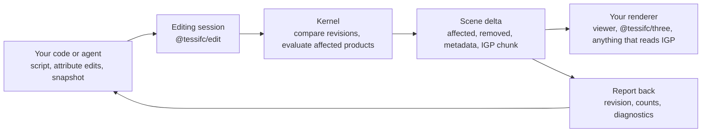

<!-- SPDX-License-Identifier: Apache-2.0 -->
# Agents and pipelines

This page is for anyone who wants the viewer's editing loop in their own
program: a script or an agent changes an IFC model, TessIFC works out which
products that touched, re-tessellates only those, and hands back a delta that
a renderer applies. Nothing here needs the reference viewer.

## The loop



Three things hold the loop together:

1. **The session owns the committed revision.** Every change is staged as a
   candidate, evaluated, checked, and only then committed. A failed script,
   a rejected snapshot or unacceptable geometry leaves the previous revision
   in place. Undo and redo are new revisions, never a rewind of the scene.
2. **The kernel decides the affected set.** Scripts and agents say what they
   want to change; the comparison of the old and new model, with its
   dependency rules for openings, shared representations, placements, styles
   and materials, says what has to be rebuilt. A rename rebuilds nothing.
3. **The delta is the contract.** Whatever produced it, the renderer applies
   the same object: products to retire, an IGP chunk with their replacements,
   and the new hierarchy.

## Choose an entry point

| You have | Use | What runs where |
|---|---|---|
| A browser or Node program with the kernel | `createEditingSession` from `@tessifc/edit` | Scripts in JavaScript next to the kernel; deltas in memory |
| A three.js scene | `createRetainedModel` from `@tessifc/three` | Applies deltas mesh by mesh |
| Python and IfcOpenShell | `tessifc-session` (`adapters/ifcopenshell`) | Scripts in Python; the file is the exchange; the viewer follows it |
| Any process that can write a file | Save the IFC, let a session or the viewer ingest it | Snapshot comparison, no instrumentation needed |
| An LLM of your choice | `createAgentTools` and `runAgentTurn`, or the Python `Assistant` | Two tools: inspect and propose; you keep the transport |

## A pipeline in Node

```js
import { Kernel } from "@tessifc/core/node";
import { createEditingSession } from "@tessifc/edit";

const kernel = new Kernel();
const id = kernel.openModel(bytes);
const session = createEditingSession(kernel, id, { settings: { includeOpenings: true } });
const { pack } = session.evaluate();            // the initial scene, as a parsed IGP pack

const { report, delta } = session.runScript(`
  const wall = ifc.byType("IfcWall")[0];
  const opening = ifc.addBox("IfcOpeningElement", "Door opening",
    { at: [1, 0, 0], size: [0.9, 0.4, 2.1], relativeTo: wall });
  const door = ifc.addBox("IfcDoor", "Door", { at: [1, 0, 0], size: [0.9, 0.05, 2.1], relativeTo: wall });
  ifc.void(wall, opening);
  ifc.fill(opening, door);
  ifc.contain(door, ifc.container(wall));
  print("added", door);
`);
console.log(report.stdout, delta.revision, delta.affectedProducts);   // wall, opening, door
renderer.apply(delta);                                                 // your adapter
await fs.writeFile("edited.ifc", session.export());
```

`delta.kind` is `selective`, `full` (a global change such as units or a
context) or `direct` (from `refreshProducts`). Apply `full` by rebuilding the
scene from `delta.pack`; apply the others by retiring
`affectedProducts` and `removedProducts` and adding every instance in
`delta.pack`. `metadataProducts` changed without geometry; refresh their
labels. `delta.hierarchy` is the new spatial tree.

## Refreshing specific objects

Sometimes your program already knows what changed, or wants fresh geometry
for a few products without a revision at all:

```js
const delta = session.refreshProducts([wallId, doorId]);   // kind: "direct"
scene.applyDelta(delta);
```

This re-tessellates exactly those products with the session's settings and
coordinate frame. It does not consult the dependency rules, so use it for
what you know, and the revision path for what the model knows. The same
holds for `session.setAttributes([...])`, which stages named attribute
values while preserving every other byte of the file.

## Giving an agent the loop

The tools are deliberately small: `inspect_model` runs a read-only script and
returns its output, `propose_edit` submits one script with a one-sentence
summary, and `undo_edit` republishes the previous revision. The model reads
the schema-aware script API from the system prompt and writes ordinary code
against it; you keep the transport, the model choice and the approval policy.

```js
import { createAgentTools, runAgentTurn } from "@tessifc/edit";

const tools = createAgentTools(session, { policy: "review", selection: { ids: [wallId] },
  onDelta: (delta) => scene.applyDelta(delta) });

const turn = await runAgentTurn({
  complete: callYourModel,      // ({ system, tools, messages }) => { text, toolCalls, stop }
  tools,
  mode: "edit",
  prompt: "Add a door to the selected wall",
  context: describeModel(session),
});
for (const proposal of turn.proposals) {
  console.log(proposal.summary, proposal.script);
  const { delta } = await tools.run(proposal);   // after review; policy "auto" runs it in the turn
}
```

`complete` is the only provider-specific piece. `toMessagesTools` and
`toChatTools` map the definitions to the two common wire shapes; the viewer's
[assistant](../viewer/src/assistant.js) shows a complete adapter for each,
including how tool calls and results are echoed back.

Recommended policy: keep `review` as the default and let a person run the
proposal, switch to `auto` only for scoped, tested operations. Report the
kernel's numbers, not the model's prose: the revision, the affected and
removed products and any diagnostics come from the delta.

In Python, `tessifc_session.Assistant` takes any provider object with a
`complete(system=, tools=, messages=)` method returning a Messages-API-shaped
response; the loop, the tools and the context are the same. The
[session server](../adapters/ifcopenshell/README.md) exposes the same
operations over loopback HTTP for tools that speak neither language.

## Verifying an edit

A visually plausible frame is not a proof. After each delta, check the
numbers the session gives you:

* `delta.affectedProducts` and `removedProducts` match the intent (a rename
  affects nothing; a moved opening affects the host too).
* `report.operations` counts the records the script created, modified and
  deleted, and `report.error` is null.
* Existing outcomes: `kernel.getProductOutcomes` after `evaluate()` and the
  candidate's `impact.productOutcomes` name products with no usable geometry.
* Independent check: reopen the exported file with any IFC tool, or evaluate
  it from scratch and compare per-product triangles with the patched scene.
  The viewer's test suite does exactly that comparison.

## Boundaries

Scripts run with your program's permissions and without a sandbox, in the
browser worker or in the session process. Review generated scripts before
running them and keep provider keys out of anything a script can read. The
session reparses the whole candidate file and scans dependencies model-wide;
selective work is the tessellation and the renderer update, which is where
the time went. Very long sessions should export and reopen occasionally to
compact retired scene slots.
