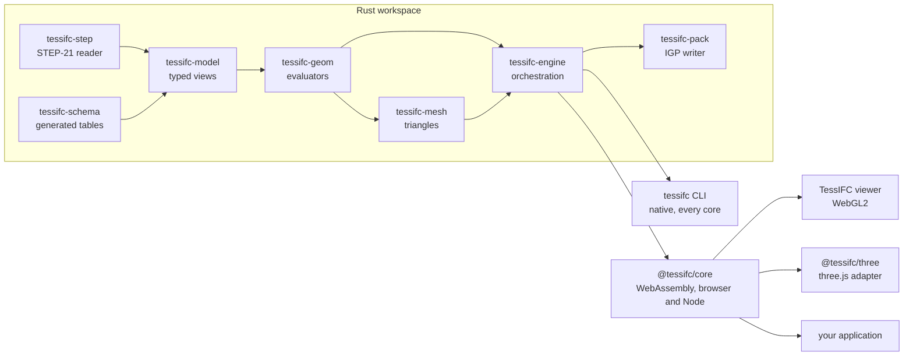
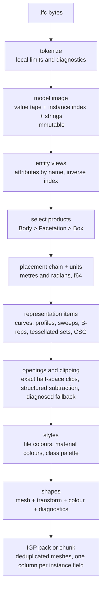
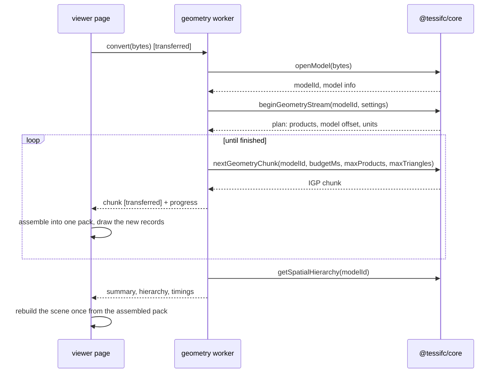
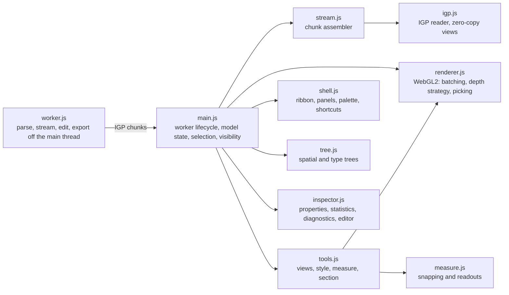

<!-- SPDX-License-Identifier: Apache-2.0 -->
# Architecture

How an IFC file becomes triangles on a screen, and which part of TessIFC
does which step.

## One codebase, three targets



The kernel is the seven crates. Everything to the right of them is a thin
consumer. Every consumer reads the same container, IGP, so a mesh is the same
whether it came from the command line or a browser tab.

## The pipeline



Three rules hold at every stage:

* **Fail per element.** An item the kernel cannot evaluate yields a
  diagnostic with a stable code and, where possible, a degraded mesh.
  Host resource failures can still terminate a conversion; see the preview contract.
* **f64 inside, f32 out, origin-shifted.** Coordinates are evaluated in
  double precision. A model offset is chosen before any geometry exists, so
  a stream and a whole pack agree on it.
* **Deterministic geometry.** Product and geometry order are reproducible for
  the same input and settings. Timing metadata and chunk boundaries can differ;
  the native and WASM builds agree on geometry and product outcomes.

## Crate map

| Crate | Owns | Never does |
|---|---|---|
| `tessifc-step` | STEP-21 tokenizer, model image, source-preserving edits | geometry |
| `tessifc-schema` | Generated tables for IFC2X3, IFC4, IFC4X3 | parsing, geometry |
| `tessifc-model` | `Entity` views, attribute access by name, the inverse index | mutation |
| `tessifc-geom` | Units, placements, curve, profile, solid and product evaluators, styles, the `Registry` | file I/O, output formats |
| `tessifc-mesh` | Triangulation, welding, normals, clipping, structured booleans | anything IFC-specific |
| `tessifc-pack` | IGP writer | evaluation |
| `tessifc-engine` | Product selection, evaluation, streaming sessions, the parallel path | rendering |

## The model image

The parser produces one immutable structure, not an object graph:

* a **value tape**: each instance's arguments packed with one-byte tags;
* an **instance index** sorted by express id: class, tape offset and length,
  source line;
* a **string arena** with duplicates interned;
* **class buckets**, so every `IfcWall` is one lookup;
* the **diagnostics** raised while reading.

It is cheap to share between workers and cheap to drop. A typed `Model` wraps
it with attribute access by name and an inverse index built once on first
use: which openings void a wall, which product fills an opening, which style
applies to an item, which items a mapped representation places.

## Geometry evaluation

Evaluators are registered per IFC class in a `Registry`. Curve, profile and
solid evaluators are trait objects; the engine dispatches on the class of the
representation item, with subclass fallback, and each evaluator may call back
into the registry for its sub-items. An evaluator is pure: it takes a context
holding the model, units, tolerances, settings, caches and a diagnostic sink,
and returns a mesh or an error. Adding a class touches one file.

Two things make real files cheap:

* **Shared family geometry.** A product whose body is placed family geometry
  with nothing to cut leaves the engine as the family's mesh by reference and
  this product's placement. The packer writes each family once.
* **Caches that survive batches.** Placements, profiles, curves and family
  meshes are cached per session, so a stream does not re-tessellate a family
  for every chunk that places it.

Booleans are deliberately narrow: exact plane clipping of closed meshes,
convex cutters as sequences of clips, and structured subtraction of
prismatic openings from prismatic bodies. Anything outside those proofs
emits the un-cut body with a diagnostic. There is no external CSG kernel.

## Streaming

The engine evaluates in batches through a `Session`. The WASM binding
exposes it as three calls, and the viewer's worker drives them:



The first chunk is small so the first paint is early; later chunks grow.
Geometry ids are global across the stream and a mesh is written in the chunk
that first places it. The container contract is in
[igp-format.md](igp-format.md).

Natively, `tessifc convert` runs the same evaluation over every core, one
product per unit of work, and collects results in express-id order so the
geometry order agrees with serial evaluation. Timing metadata differs.

## The IGP container

```
+----------------------+------------------------------+------------------------------+
| 24-byte header       | JSON index (padded to 8)     | BIN chunk (8-byte aligned)   |
| magic, version,      | geometries[], instances{},   | positions, indices, one      |
| lengths, flags       | classes[], diagnostics[],    | column per instance field    |
|                      | stats, stream                |                              |
+----------------------+------------------------------+------------------------------+
```

A GLB-shaped container that needs no library to read. Every instance carries
its express id, IFC class, RGBA colour, a column-major transform and flags, so
a pick resolves to an element without a side table.

## The viewer

The reference viewer is first-party JavaScript over WebGL2 with no runtime
dependency and a Content Security Policy that forbids remote code.



Rendering is three passes per frame. An unbiased opaque pass writes canonical
depth. A bounded overlay redraws only materials whose bounding boxes overlap
another opaque material, in a fixed colour order with depth writes off and a
polygon offset clamped to a sub-millimetre envelope, so two products that
share a face show one stable winner instead of fighting while the camera
moves. Translucent products are then blended back to front. The overlay
works on both depth conventions a browser can grant, stays active while a
model is still streaming, and falls back to a bounded whole-unit step on
browsers without a polygon offset clamp. Measurements are drawn on a 2D
canvas above the WebGL one.

## Extension points

| You want to | Do this |
|---|---|
| Support another IFC class | Implement `SolidEvaluator`, `CurveEvaluator` or `ProfileEvaluator` in `crates/ifc-geom/src/eval/` and register it |
| Change what gets evaluated | `Settings` in `tessifc-geom`, exposed as JSON to the WASM API and as flags to the CLI |
| Consume geometry in another renderer | Read IGP; start from `adapters/three/src/build.js`, which turns a kernel into plain typed arrays |
| Ship a smaller WASM | Build with one schema feature, see `bindings/wasm/README.md` |
