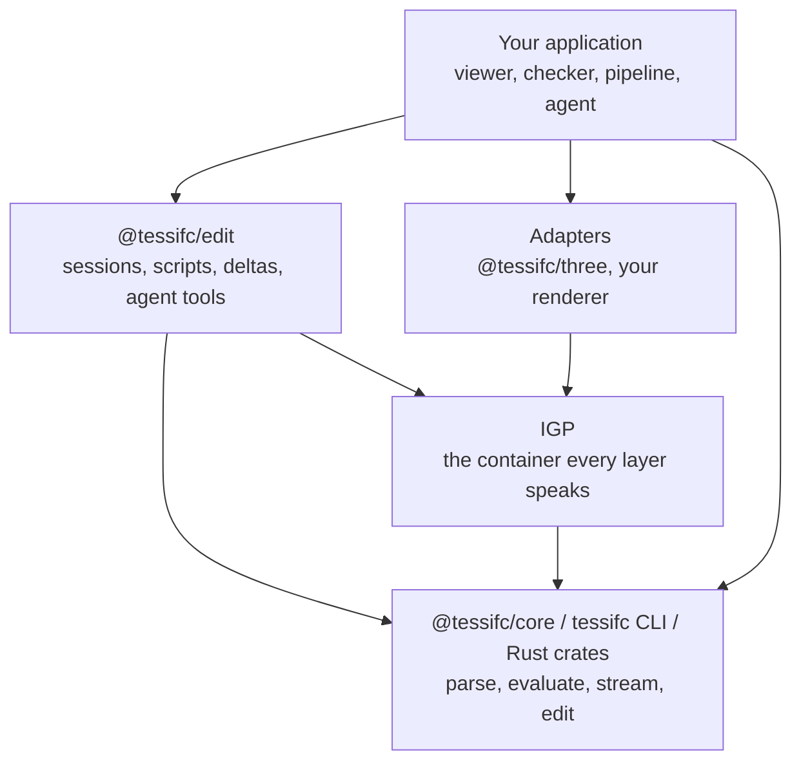

<!-- SPDX-License-Identifier: Apache-2.0 -->
# The TessIFC SDK

The v0.1 developer preview exposes one Rust kernel through native and WASM
interfaces. Start with the [local build](getting-started.md) and read the
[preview contract](preview.md). Registry installation applies after publication.

## Packages

| Package | Registry | What it is | Status |
|---|---|---|---|
| `@tessifc/core` | npm | The WebAssembly kernel and its TypeScript declarations. Browser and Node builds. | preview |
| `@tessifc/edit` | npm | The editing session, browser scripts, the IGP reader and agent tools over the kernel. | preview |
| `@tessifc/three` | npm | Shape arrays to three.js meshes, a retained scene that applies deltas, camera fitting and cleanup. | preview |
| `tessifc-session` | source only | The optional Python editing session behind the viewer's Session panel. | preview |
| `tessifc-cli` | crates.io | The `tessifc` binary: `info`, `convert`, `edit`, `coverage`. | preview |
| `tessifc-step`, `-schema`, `-model`, `-geom`, `-mesh`, `-pack`, `-engine` | crates.io | The kernel crates, for Rust hosts and for people writing evaluators. | preview |
| the viewer | GitHub Pages | The reference application over `@tessifc/core`. | preview |

All packages are versioned together. A release is one tag and one set of
artefacts on the GitHub Releases page.

## Layers



Two rules keep the layers honest:

* The **kernel never learns about a renderer**. It emits IGP and typed arrays.
  If you need something a renderer needs, the answer is an adapter, not a
  kernel feature.
* **IGP v0 is frozen.** A reader written against `docs/igp-format.md` keeps
  working. Additions arrive as new optional members that old readers ignore.

## Stability

| Surface | Promise |
|---|---|
| `Kernel` methods listed below | Preview API. Pin versions; minor releases may change interfaces. |
| Settings JSON keys | Additive. Unknown keys are ignored, so a newer host talks to an older kernel. |
| IGP v0 layout | Frozen. Changes need a version bump. |
| Diagnostic codes | Stable enums. New codes may appear; existing codes keep their meaning. |
| `tessifc info --json` and `convert --json` | Fields may be added, never renamed or repurposed. |
| Rust crate APIs | Best effort until 1.0. Evaluator traits are the extension point and change last. |

## The Kernel API

`@tessifc/core/web` exports a default `init`, `version`, `initPanicHook` and
the `Kernel` class. The Node build loads synchronously and has no `init`.
One kernel can hold multiple models, each addressed by an integer.
Close models explicitly and call `kernel.free()` when finished with the kernel.

```ts
import init, { Kernel, version } from "@tessifc/core/web";

await init();                 // loads the .wasm next to the module
const kernel = new Kernel();
const id = kernel.openModel(bytes, JSON.stringify({ schemaOverride: "IFC4" }));
// ...
kernel.closeModel(id);
kernel.free();
```

Structured results cross the boundary as JSON strings: parse them. Geometry
crosses as typed arrays, which is the one place the cost is measurable.

### Lifecycle

| Method | Returns | Notes |
|---|---|---|
| `openModel(bytes, settings?)` | model id | Recoverable parse errors become diagnostics; check model info and diagnostics. Invalid settings can throw; resource failures may trap. Settings: `schemaOverride`, `maxEntities`. |
| `closeModel(id)` | boolean | Frees the model and its geometry. |
| `closeAll()` | | |
| `modelCount()` | number | |
| `releaseGeometry(id)` | boolean | Drops evaluated geometry and any stream in progress, keeps the model open for inspection and edits. |

### Inspection

| Method | Returns |
|---|---|
| `getModelInfo(id)` | JSON: `schema`, `schemaDeclared`, `schemaApproximate`, `bytes`, `entities`, `classes` and `products` (counts by class name), `productTotal`, `imageBytes`, `sourceRetainedBytes`, `diagnostics` (`total`, `errors`, `warnings`) and `header`. |
| `getDiagnostics(id)` | Parse diagnostics: JSON array of `{ code, severity, line, expressId, message }`. `expressId` is null when not tied to an instance, and `line` is 0 when unavailable. Geometry diagnostics are in IGP packs. Branch on `code`, not message text. |
| `getClassName(id, expressId)` | the IFC class, or `undefined` for an unknown id. |
| `getProductCategory(id, expressId)` | `physical`, `space`, `opening`, `annotation` or `reference`; `undefined` for a non-product. |
| `getIdsOfType(id, className)` | `Uint32Array` of every instance of the class or its subtypes. |
| `getEntityInfo(id, expressId)` | JSON: attributes by schema name with raw STEP spelling and decoded text. Vendor classes expose numbered arguments. |
| `getSpatialHierarchy(id)` | JSON node list: project, site, building, storey, and every rendered product under its container. |
| `getClassAttributes(id, className)` | JSON: `class`, `abstract` and `attributes` in STEP argument order with `name`, `type`, `base`, `aggDepth`, `optional` and `derived`; `undefined` for a class outside the model's schema. |

The kernel report is camelCase; `tessifc info --json` is snake_case. The two
cover most of the same ground, and each carries what only it can see: the CLI
adds the timing and process figures, the kernel adds what it retains in WASM
memory. A host that wants parse timing measures it around `openModel` itself.

### Geometry, whole

`getGeometryCapabilities(id)` returns the schema entity inventory with direct
and inherited evaluator routes. It describes dispatch, not complete coverage.
After evaluation, `getProductOutcomes(id)` returns per-product outcome records.
Read them before `takePack` releases the evaluation. Stream outcomes remain
available while that stream is retained; `cancelGeometryStream(id)` releases it.

```ts
const summary = JSON.parse(kernel.evaluateGeometry(id, JSON.stringify({ includeOpenings: false })));
const outcomes = JSON.parse(kernel.getProductOutcomes(id));
const pack = kernel.takePack(id);    // Uint8Array, IGP v0; releases the evaluation
```

Or per shape, for a host that wants arrays rather than a container:
`shapeCount`, `shapeExpressId`, `shapeClass`, `shapePartCount`, `shapeColor`,
`shapePositions`, `shapeIndices`. Positions are f32 in metres with the model
offset removed; add `summary.modelOffset` back in f64 for world coordinates.

Geometry settings use the same JSON field names and defaults as Rust `Settings`
and CLI `convert --settings '<json>'`. Known fields with the wrong type or out-of-range
values throw at the WASM boundary; unknown fields are ignored for forward compatibility.
Evaluation and stream summaries return `effectiveSettings`.

| Field | Default | Meaning |
|---|---|---|
| `chordToleranceM` | `0.002` | Positive finite chord sagitta in metres |
| `angularToleranceRad` | `Math.PI / 18` | Maximum circle segment angle, in `(0, pi]` |
| `maxCircleSegments` | `512` | Circle budget, from 8 to 4096 |
| `maxSurfaceVertices` | `16384` | Vertex budget per trimmed surface patch, from 64 to 1048576 |
| `circleSegments` | `null` | Optional fixed count, from 3 to `maxCircleSegments` |
| `maxDepth` | `24` | Representation and boolean-chain nesting, from 1 to 128 |
| `weld` | `true` | Weld vertices before closure checks |
| `cutOpenings` | `true` | Subtract related opening geometry |
| `repairPcurveDomains` | `true` | Recover inconsistent parameter scales only after checking the separate 3D curve |
| `repairSurfaceCurves` | `false` | Opt in to diagnosed recovery of inconsistent surface-curve references and edge orientations |
| `includeSpaces` | `true` | Include space and spatial-zone volumes |
| `includeOpenings` | `false` | Include opening and voiding-feature geometry |
| `includeAnnotations` | `false` | Include available annotation and grid geometry |
| `includeReferences` | `false` | Include available port, positioning and analysis geometry |

A segment count or refinement budget can prevent the requested tolerance from being
met. Such output carries `W_TESSELLATION_TOLERANCE_UNMET`; it is not an accuracy
certificate. B-spline and pcurve subdivision refuses the item with
`E_GEOMETRY_LIMIT_REACHED` when its point or depth limit prevents further work.
A recovered pcurve carries `W_PCURVE_DOMAIN_RECOVERED`. Set
`repairPcurveDomains: false` to refuse those repairs.

`repairSurfaceCurves: true` additionally permits three guarded repairs: replacing
an inconsistent pcurve with its 3D reference after checking sampled distances to
the surface; correcting duplicate dehomogenization of rational reference control
points when the resulting path agrees with the surface pcurve and edge vertices;
and reversing an edge whose opposite end continues the preceding edge. These
emit `W_PCURVE_3D_FALLBACK`, `W_PCURVE_REFERENCE_RECOVERED` and
`W_EDGE_ORIENTATION_RECOVERED`, respectively. The source model is unchanged.
Sampled agreement is not proof that an invalid export has been reconstructed
exactly. Strict conversion rejects all of these repairs.

Increasing `maxSurfaceVertices` can admit more detailed patches but increases
memory and work per face. It does not repair invalid topology or guarantee that
the chord tolerance can be met. This is a per-patch limit, not a model-wide budget.

CLI flags `--circle-segments` and `--chord-tolerance-m` override their JSON fields.
`convert --strict` returns failure and does not write the requested pack when
loss or approximation diagnostics are present. Its JSON report says `output_written`.

Every included helper product carries an IGP instance flag. A viewer can keep
the geometry available for inspection while excluding it from its initial
draw, camera bounds, picking and depth-overlap analysis. `getProductCategory`
exposes the same schema-aware classification before or without packing.

### Geometry, streamed

```ts
const plan = JSON.parse(kernel.beginGeometryStream(id, settings));
let chunk;
while ((chunk = kernel.nextGeometryChunk(id, 220, 0, 600_000))) {
  postMessage({ chunk: chunk.buffer }, [chunk.buffer]);       // transfer, do not copy
  const progress = JSON.parse(kernel.streamProgress(id));    // done, total, emitted, triangles, chunks, finished, diagnostic counts
}
```

A chunk stops at whichever limit comes first: milliseconds, products or
triangles, zero meaning no limit, and holds at least one product when products remain. A model with no selected
products still produces one final metadata chunk with its diagnostics. Every
chunk is a valid IGP pack with a `stream` member; the last one carries the
diagnostics and statistics. Geometry ids are global across the stream.

`getProductOutcomes(id)` reports each product as `filtered`, `no_representation`,
`no_usable_representation`, `pending`, `emitted`, or `empty_or_failed`. Read the
diagnostics for the reason; `emitted` means at least one mesh part exists and does
not imply that every requested operation succeeded. Query whole-model outcomes
before `takePack`, or query the retained stream after its final chunk.

`getGeometryCapabilities(id)` lists every entity in the model's schema with its
direct and inherited registry routes. Routes describe dispatch, not conformance.
The native equivalent is `tessifc coverage --inventory`.

`cancelGeometryStream(id)` releases stream caches while keeping the parsed model.
Chunk time limits are checked between products. To interrupt a synchronous product
operation, terminate its worker and open the model in a new worker.

### Geometry, patched

```ts
const patch = kernel.evaluateProducts(id, Uint32Array.from([expressId]), JSON.stringify({
  modelOffset: pack.index.model_offset,
  firstGeometryId: nextFreeGeometryId,
}));
```

Re-evaluates named products into one self-contained final chunk, for
replacing their records after an edit. The caller decides which products an
edit affects; see [editing](editing.md). Use staged revisions when the kernel
should discover the affected products.

### Geometry revisions

The revision API accepts a complete edited IFC snapshot or a set of attribute
edits. The committed model remains available during preparation. Revision numbers
and candidate tokens are opaque strings scoped to an open model.

| Method | Returns / effect |
|---|---|
| `getModelRevision(id)` | Current revision string, initially `"0"`; undefined for an unknown model. |
| `prepareRevision(id, bytes, baseRevision)` | Parses and validates a candidate snapshot; returns its JSON impact. |
| `prepareAttributeEdits(id, editsJson, baseRevision)` | Prepares source-preserving edits, each `{ expressId, attribute, value, raw }`; returns the same impact format. |
| `getPreparedRevisionInfo(id)` | JSON impact plus evaluation acceptance, outcomes and diagnostics, or undefined without a candidate. |
| `evaluatePreparedRevision(id, candidateToken, settings?)` | Evaluates affected products and returns a self-contained IGP v0 chunk, including an empty chunk for metadata or deletion-only changes. |
| `commitRevision(id, baseRevision, candidateToken)` | Commits an accepted candidate and returns its new revision string. Geometry changes require accepted evaluation. |
| `discardRevision(id, candidateToken)` | Discards the matching candidate without changing the committed model; returns whether one existed. |

Only one candidate may be pending for a model. Preparation refuses a stale base
revision. Evaluation, commit and discard also require the token returned by preparation,
so a delayed operation cannot accidentally commit a replacement candidate.
Legacy immediate attribute edits advance the revision and discard any candidate.

The impact reports `createdEntities`, `modifiedEntities`, `deletedEntities`,
`affectedProducts`, `removedProducts`, `metadataProducts`, `fullRebuild`, and
`reasons` entries with `expressId`, `entityId` and `reason`. Entity IDs belong to
the relevant old or new snapshot: removed products address the old scene;
affected products address the candidate. A full rebuild replaces the entire
scene, including its old identities. Hierarchy nodes include available `globalId`
values for restoring product selection and visibility.

```ts
const base = kernel.getModelRevision(id);
const candidate = JSON.parse(kernel.prepareRevision(id, editedBytes, base));
let committed = false;
try {
  const patch = kernel.evaluatePreparedRevision(id, candidate.candidateToken, JSON.stringify({
    ...geometrySettings,              // same effective settings as initial evaluation
    modelOffset: pack.index.model_offset,
    firstGeometryId: nextFreeGeometryId,
  }));
  const impact = JSON.parse(kernel.getPreparedRevisionInfo(id));
  if (!impact.evaluationAccepted) throw new Error("Candidate geometry was rejected");
  const revision = kernel.commitRevision(id, base, candidate.candidateToken);
  committed = true;
  // Apply patch atomically in the host: retire removed/affected product records,
  // append replacements, or replace the whole scene when impact.fullRebuild.
  // Record revision only after the host has applied that patch successfully.
} finally {
  if (!committed) kernel.discardRevision(id, candidate.candidateToken);
}
```

`modelOffset` must match the existing scene; `firstGeometryId` must be above its
allocated geometry IDs. Geometry settings must match the established evaluation
or stream, even after its geometry is released. A policy or coordinate-frame
change needs an explicit whole-model evaluation. The host owns patch delivery,
resource allocation and recovery if applying an already committed patch fails.

The comparator scans both complete parsed models and follows old and new
dependencies conservatively. Unknown/global changes can request a full rebuild.
New failed geometry, refused operations and packing failures prevent acceptance;
inspect outcomes and diagnostics for the exact reason. Existing unsupported
geometry can remain unchanged without blocking an unrelated edit. This does not
constitute schema, authoring or engineering validation of the edited IFC.

The reference viewer's assembler keeps unchanged instance slots stable and adds
an `active` column to its in-memory assembled pack. Consumers must skip inactive
slots; `activeCount` counts live instances while `count` includes retired slots.
These columns are viewer state, not additions to the IGP v0 binary format. Its
renderer applies the resulting delta to affected GPU batches. The three.js
adapter currently remains a static-load adapter; hosts integrating revisions
there must implement scene replacement and resource ownership themselves.

### Editing and export

| Method | Effect |
|---|---|
| `setAttribute(id, expressId, name, value, raw)` | Replace one named attribute and reparse. `raw` means `value` is complete STEP syntax. |
| `setAttributes(id, expressId, editsJson)` | Several attributes as one rewrite and one reparse. Preferred for a form save. |
| `setArgument(id, expressId, index, value, raw)` | By zero-based argument index; the route for vendor classes. |
| `exportModel(id)` | The committed source bytes. Attribute edits preserve unrelated spans; snapshot revisions retain submitted bytes. |

## The editing session

`@tessifc/edit` is a pure JavaScript package over the kernel for the browser
and Node. It owns one open model's committed revision and turns every kind of
change into a scene delta that a renderer adapter applies.

```js
import { Kernel } from "@tessifc/core/node";
import { createEditingSession } from "@tessifc/edit";

const kernel = new Kernel();
const id = kernel.openModel(bytes);
const session = createEditingSession(kernel, id, { settings: { includeOpenings: true } });
const { pack, summary, outcomes, hierarchy } = session.evaluate();   // the initial scene
const { report, delta } = session.runScript('ifc.byType("IfcWall")[0].Name = "Renamed";');
```

A host that streamed or evaluated the model itself calls
`session.adopt({ modelOffset, nextGeometryId })` instead of `evaluate()`; the
kernel requires every patch to keep the initial settings and coordinate frame.

| Method | Effect |
|---|---|
| `evaluate()` | Evaluate the whole model; returns `{ pack, summary, outcomes, hierarchy }` and fixes the scene basis. |
| `adopt({ modelOffset, nextGeometryId })` | Take over a scene the host built, with the pack's offset and the next free geometry id. |
| `runScript(source, selection, { commit })` | Run a browser script; returns `{ report, delta }`, `delta` null when nothing changed. `commit: false` discards edits. |
| `setAttributes(edits)` | Publish `{ expressId, attribute, value, raw }` edits, preserving unrelated bytes. |
| `applySnapshot(bytes)` | Publish an externally edited copy of the file. |
| `refreshProducts(expressIds)` | Re-tessellate named products without a revision; the host chose the set. |
| `undo()`, `redo()` | Republish the source before or after the last change as a new revision. |
| `export()`, `entity(id)`, `classDefinition(name)`, `hierarchy()` | The committed bytes, one entity's attributes, a class's schema, the spatial tree. |
| `revision`, `history`, `modelOffset`, `nextGeometryId` | The committed revision, undo and redo depths, and the scene basis. |

A delta is a plain object:

| Field | Meaning |
|---|---|
| `kind` | `selective`, `full` (rebuild the scene from `pack`) or `direct` (from `refreshProducts`). |
| `revision`, `baseRevision` | The committed revision after and before; unchanged for `direct`. |
| `chunk`, `pack` | The IGP v0 bytes and their parsed form: every instance of every affected product. |
| `affectedProducts`, `removedProducts`, `metadataProducts` | Products to replace, to drop, and whose attributes changed without geometry. |
| `impact` | The kernel's full report with `reasons`, `productOutcomes` and `diagnostics`; null for `direct`. |
| `hierarchy` | The spatial tree after the change. |
| `timings` | `prepareMs`, `geometryMs`, `totalMs`. |

A rejected candidate throws; the error carries `impact` with the diagnostics.
The committed revision is untouched.

### Browser scripts

`runScript` executes JavaScript beside the kernel and turns the recorded
edits into a snapshot for `prepareRevision`. The engine is exported on its
own (`createScriptEngine`, `runScript` from `@tessifc/edit/script-engine`) for
hosts that publish differently. Scripts see `ifc`, `selected`, `selection`
and `print`:

| Name | Effect |
|---|---|
| `ifc.byType(name)`, `ifc.get(id)`, `ifc.byGuid(guid)` | Entities of a class and its subtypes, one entity by express id, one rooted entity by GlobalId. |
| `entity.Name`, `entity.Items[0].Depth`, `entity.Name = "x"` | Attributes by IFC name; references resolve to entities, lists to arrays, `$` to `null`. Assignment records an edit. |
| `entity.id`, `entity.type`, `entity.is(name)`, `entity.attributes()` | Identity, class, subtype test, all attributes as an object. |
| `ifc.add(className, attributes)` | A new record from attributes by name (or a positional array) in the model's schema; missing required attributes are an error, a missing `GlobalId` is generated. |
| `ifc.remove(entity)` | Deletes the record and detaches every reference; a relationship that loses a required end is removed too. |
| `ifc.addBox(className, name, { at, size, relativeTo, attributes })` | A placed rectangular extrusion with a Body representation. |
| `ifc.contain`, `ifc.void`, `ifc.fill`, `ifc.aggregate` | The containment, voiding, filling and aggregation relationships. |
| `ifc.inverses(entity, className)`, `ifc.container(product)` | Entities referencing one; the containing spatial structure. |
| `ifc.newGuid()`, `ifc.enum(v)`, `ifc.typed(type, v)`, `ifc.int(n)`, `ifc.context()`, `ifc.schema` | Values that need a marked form, the model context and its schema name. |

The report carries `ok`, `stdout`, `error`, `traceback` (the failing script
line), `changed` and `operations` (created, modified and deleted record
counts). Serialization follows the declared base type: numbers become reals
unless the attribute is an integer, plain strings become enumerations where
one is declared, and select values need `ifc.typed`. Non-ASCII text is written
with STEP escapes; untouched records keep their bytes.

### Agent tools

`@tessifc/edit/agent-tools` holds the provider-neutral half of an assistant:
`SYSTEM_PROMPT` with the script API, `TOOLS` (`inspect_model`,
`propose_edit`, `undo_edit`), `toolsFor(mode)`, the `toMessagesTools` and
`toChatTools` mappers, `createAgentTools(session, { policy, selection,
onDelta })` which executes calls against a session, and `runAgentTurn` which
drives any `complete` function until the model answers. [Agents and
pipelines](agents.md) walks through it. The viewer's assistant is one client
of these; its provider adapters are in `viewer/src/assistant.js`.

### three.js

`createRetainedModel(THREE, pack)` from `@tessifc/three` builds one mesh per
placed instance from a parsed IGP pack, sharing a `BufferGeometry` per IGP
geometry, and `applyDelta(delta)` retires the affected and removed products
and adds the delta's instances; a `full` delta rebuilds everything.
`meshesOf(expressId)`, `setVisible`, `productIds()` and `dispose()` complete
it. Helper geometry (openings, spaces, references) starts invisible. This
retained scene favours correctness over draw-call count; `loadModel` remains
the merged static path.

### Python session

`adapters/ifcopenshell` is an optional Python package, `tessifc-session`, that
owns one IFC file, runs scripts against it with an installed IfcOpenShell and
publishes revisions to the viewer. The kernel has no dependency on it.

```python
from tessifc_session import EditSession

session = EditSession("model.ifc")
result = session.run_script("selected.Name = 'Renamed'", {"guids": ["2Ab...guid"]})
result["ok"], result["changed"], result["stdout"], result["operations"]
session.undo()
```

`run_script(source, selection=None, commit=True)` executes inside a transaction
and returns `ok`, `changed`, `version`, `stdout`, `operations` (journaled
create, edit and delete counts), `elapsedMs`, and on failure `error` and
`traceback`. `commit=False` discards every change, which is how the assistant
inspects the model. `undo()` and `redo()` restore content as new versions.
`wait_for_change(version, timeout)` blocks until the file has different
content, whichever process wrote it.

The server exposes the session on the loopback interface. Every command needs
the `X-Tessifc-Token` header carried by the status response, and a matching
`Origin` header.

| Route | Effect |
|---|---|
| `GET /__tessifc/session?after=<version>&timeout=<s>` | Status JSON: `name`, `version`, `revision`, `busy`, `undo`, `redo`, `capabilities` and `token`. With `after`, it waits until the version changes or the timeout passes. |
| `GET /__tessifc/model.ifc?version=<version>` | The snapshot bytes for that version, or 409 when the content moved on. |
| `POST /__tessifc/run` | `{ "script": "...", "selection": { "guids": [], "ids": [] } }` runs a script; the result is the `run_script` record plus `status`. |
| `POST /__tessifc/undo`, `POST /__tessifc/redo` | Publish the previous or restored content. |
| `POST /__tessifc/assistant` | `{ "mode": "ask" or "edit", "prompt", "policy": "review" or "auto", "selection", "history" }` returns `answer`, `proposal` (`script`, `summary`), `run` and `usage`. |

A host that drives this protocol from its own tools gets the same behaviour as
the panel: `viewer/src/file-session.js` is the reference client, including the
long poll and the wait for the viewer to apply a version. The viewer's own
kernel then computes the affected products; the script never decides that.

The assistant provider is selected with `--assistant anthropic`, `fake` or
`none`; `anthropic` is the default when `ANTHROPIC_API_KEY` is set and needs
`pip install anthropic`. `--model` and `--effort` pass through to the request.
Scripts run in the session process without a sandbox.

## Reading IGP

You do not need a library. `docs/igp-format.md` ends with a twenty-line
JavaScript reader and a NumPy one. `readIgp` from `@tessifc/edit/igp` is the
complete zero-copy reader the viewer uses, and `viewer/src/stream.js` shows
how to assemble chunks into one pack with stable slots.

## Running in a worker

The kernel is synchronous and single-threaded by design. Put it in a Web
Worker so parsing and tessellation never block the page, and transfer buffers
in both directions:

```ts
// main thread
const worker = new Worker(new URL("./ifc.worker.js", import.meta.url), { type: "module" });
worker.postMessage({ type: "open", buffer }, [buffer]);
worker.onmessage = ({ data }) => {
  if (data.type === "chunk") scene.append(readIgp(data.buffer));
};

// ifc.worker.js
import init, { Kernel } from "@tessifc/core/web";
await init();
const kernel = new Kernel();
self.onmessage = ({ data }) => {
  if (data.type !== "open") return;
  const id = kernel.openModel(new Uint8Array(data.buffer));
  try {
    kernel.beginGeometryStream(id, "{}");
    let chunk;
    while ((chunk = kernel.nextGeometryChunk(id, 220, 0, 600_000))) {
      self.postMessage({ type: "chunk", buffer: chunk.buffer }, [chunk.buffer]);
    }
    self.postMessage({ type: "done", diagnostics: JSON.parse(kernel.getDiagnostics(id)) });
  } catch (error) {
    self.postMessage({ type: "error", message: String(error) });
  } finally {
    kernel.closeModel(id);
  }
};
```

`viewer/src/worker.js` adds model replacement, edits and export. The example
closes each model after streaming; keep it open if later inspection is needed.
Chunk budgets are checked between products, so one expensive product may
overrun a chunk's time limit. Terminate the worker for a hard cancellation.

## Memory contract

* A `Uint8Array` or typed array returned by the kernel is a copy you own.
  Transfer it, keep it, or drop it; the kernel does not hold it.
* The parsed model lives in WASM linear memory until `closeModel`. The source
  retained for edits and evaluated geometry consume additional memory.
* WASM32 has a 4 GiB address-space ceiling; usable memory can be considerably
  lower. There is no universal safe file-size threshold. Set host limits and
  use the native CLI when browser resources are insufficient.
* Closing models frees allocations for reuse; it does not shrink WASM linear
  memory. Terminating a worker releases its instance and memory.

## Bundlers and hosting

The generated declarations include `Symbol.dispose`. For TypeScript, include
`ESNext.Disposable` alongside your normal libraries, for example
`"lib": ["ES2022", "DOM", "ESNext.Disposable"]`. Use a compiler that provides
that library; the declarations are checked with TypeScript 5.9.

* The package is an ES module plus a `.wasm` file resolved relative to the
  module URL. Vite, webpack 5 and esbuild all handle it; if your bundler
  moves the `.wasm`, pass `init({ module_or_path: wasmUrl })`.
* Content Security Policy must allow your module and worker origins, WASM
  loading and `'wasm-unsafe-eval'`. The local viewer shows a complete policy.
* No cross-origin isolation is required. There is no SharedArrayBuffer and no
  threading in the browser build; parallelism comes from workers you spawn.
* The Node build is CommonJS with the same API, in `pkg-node/`.
* The module is built for speed; `scripts/build-wasm.py --profile wasm-release`
  is the smaller, slower build. Building with one schema feature is smaller
  still; see `bindings/wasm/README.md`.

## Diagnostics as an API

Diagnostics carry a stable code and severity, with an element ID and source
line when available. `E_`, `W_` and `I_` indicate error, warning and information.
They do not independently prove that a product was drawn: inspect the product
outcomes and geometry quality too. Packs carry evaluation diagnostics so a
host can inspect them without reopening the model.

## Integrating into an existing viewer

Add one seam, then put TessIFC behind it:

```ts
interface GeometryBackend {
  load(bytes: Uint8Array, onProgress: (done: number, total: number) => void): Promise<void>;
  onMeshBatch(cb: (batch: { geometryId: number; expressId: number; ifcClass: string;
                           matrix: Float32Array; color: Uint8Array; geometry: BufferGeometry }) => void): void;
  pick(expressId: number): void;
  dispose(): void;
}
```

Implement it once over your current engine and once over `@tessifc/core`,
ship a toggle, and diff the two on the same files.

## Preview feedback

Report missing representations with element IDs, settings and minimal inputs.
New bindings and formats are separate proposals; the supported v0.1 surface
is the package and API set documented above.
