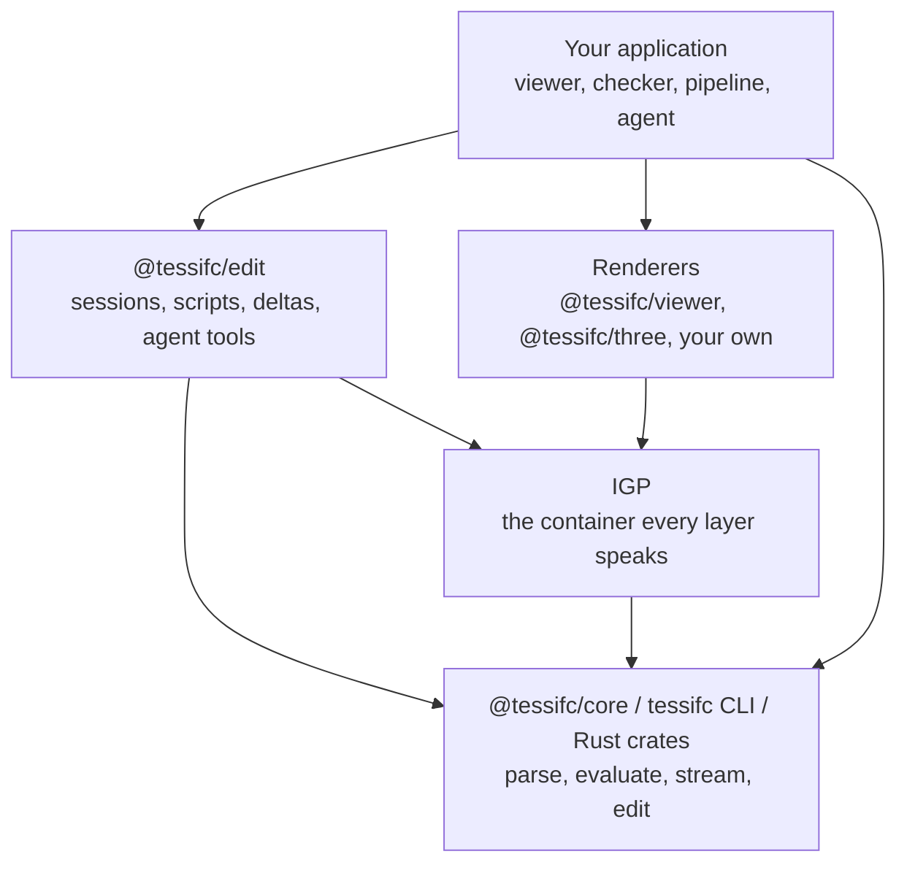

<!-- SPDX-License-Identifier: Apache-2.0 -->
# The TessIFC SDK

The v0.2 developer preview exposes one Rust kernel through native and WASM
interfaces, an editing session over it, and two ways for an agent to drive
that session. Start with the [local build](getting-started.md) and read the
[preview contract](preview.md). Packages ship as tarballs on the Releases
page; registry installation applies after publication.

## Packages

| Package | Registry | What it is | Status |
|---|---|---|---|
| `@tessifc/core` | npm | The WebAssembly kernel and its TypeScript declarations. Browser and Node builds. | preview |
| `@tessifc/edit` | npm | The editing session, scripts with building helpers, new models from nothing, the IGP reader, agent tools, provider adapters and verification over the kernel. | preview |
| `@tessifc/viewer` | npm | The WebGL2 renderer behind the reference viewer as an embeddable component: open, stream, select, hide, section, frame, apply deltas, follow a session. | preview |
| `@tessifc/mcp` | npm | A Model Context Protocol server over the kernel for Claude Code, Claude Desktop and other MCP clients, with the loopback viewer server. | preview |
| `@tessifc/three` | npm | Shape arrays to three.js meshes, a retained scene that applies deltas, camera fitting and cleanup. | preview |
| `tessifc` | wheel on the Releases page | The kernel as a native Python extension: open, report, evaluate across every core, pack and stream, with a zero-copy IGP reader; NumPy optional. | preview |
| `tessifc-session` | source only | The optional Python editing session behind the viewer's Session panel, with the same MCP tools over IfcOpenShell (`[mcp]` extra). | preview |
| `tessifc-cli` | crates.io | The `tessifc` binary: `info`, `convert`, `edit`, `coverage`. | preview |
| `tessifc-step`, `-schema`, `-model`, `-geom`, `-mesh`, `-pack`, `-engine` | crates.io | The kernel crates, for Rust hosts and for people writing evaluators. | preview |
| the viewer | GitHub Pages | The reference application over `@tessifc/core` and `@tessifc/viewer`. | preview |

All packages are versioned together. A release is one tag and one set of
artefacts on the GitHub Releases page.

## Layers



Two rules keep the layers honest:

* The **kernel never learns about a renderer**. It emits IGP and typed arrays.
  If you need something a renderer needs, the answer is an adapter, not a
  kernel feature.
* **IGP v0 is frozen.** A reader written against `docs/igp-format.md` keeps
  working. Additions arrive as new optional members that old readers ignore.

## Stability

| Surface | Promise |
|---|---|
| `Kernel` methods listed below | Preview API. Pin versions; minor releases may change interfaces. |
| Settings JSON keys | Additive. Unknown keys are ignored, so a newer host talks to an older kernel. |
| IGP v0 layout | Frozen. Changes need a version bump. |
| Diagnostic codes | Stable enums. New codes may appear; existing codes keep their meaning. |
| `tessifc info --json` and `convert --json` | Fields may be added, never renamed or repurposed. |
| Rust crate APIs | Best effort until 1.0. Evaluator traits are the extension point and change last. |

## The Kernel API

`@tessifc/core/web` exports a default `init`, `version`, `initPanicHook` and
the `Kernel` class. The Node build loads synchronously and has no `init`.
One kernel can hold multiple models, each addressed by an integer.
Close models explicitly and call `kernel.free()` when finished with the kernel.

```ts
import init, { Kernel, version } from "@tessifc/core/web";

await init();                 // loads the .wasm next to the module
const kernel = new Kernel();
const id = kernel.openModel(bytes, JSON.stringify({ schemaOverride: "IFC4" }));
// ...
kernel.closeModel(id);
kernel.free();
```

Structured results cross the boundary as JSON strings: parse them. Geometry
crosses as typed arrays, which is the one place the cost is measurable.

### Lifecycle

| Method | Returns | Notes |
|---|---|---|
| `openModel(bytes, settings?)` | model id | Plain IFC or an IFCZIP archive, which is inflated and kept as the plain text inside it (`E_IFCZIP_MALFORMED` and `E_IFCZIP_TOO_LARGE` refuse an archive; `W_IFCZIP_MULTIPLE_ENTRIES` says the first `.ifc` entry of several was taken). Recoverable parse errors become diagnostics; check model info and diagnostics. Invalid settings can throw; resource failures may trap. Settings: `schemaOverride`, `maxEntities`, `maxIfczipBytes`. |
| `closeModel(id)` | boolean | Frees the model and its geometry. |
| `closeAll()` | | |
| `modelCount()` | number | |
| `releaseGeometry(id)` | boolean | Drops evaluated geometry and any stream in progress, keeps the model open for inspection and edits. |

### Inspection

| Method | Returns |
|---|---|
| `getModelInfo(id)` | JSON: `schema`, `schemaDeclared`, `schemaApproximate`, `bytes`, `entities`, `classes` and `products` (counts by class name), `productTotal`, `imageBytes`, `sourceRetainedBytes`, `diagnostics` (`total`, `errors`, `warnings`) and `header`. |
| `getDiagnostics(id)` | Parse diagnostics: JSON array of `{ code, severity, line, expressId, message }`. `expressId` is null when not tied to an instance, and `line` is 0 when unavailable. Geometry diagnostics are in IGP packs. Branch on `code`, not message text. |
| `getClassName(id, expressId)` | the IFC class, or `undefined` for an unknown id. |
| `getProductCategory(id, expressId)` | `physical`, `space`, `opening`, `annotation` or `reference`; `undefined` for a non-product. |
| `getIdsOfType(id, className)` | `Uint32Array` of every instance of the class or its subtypes. |
| `getEntityInfo(id, expressId)` | JSON: attributes by schema name with raw STEP spelling and decoded text. Vendor classes expose numbered arguments. |
| `getSpatialHierarchy(id)` | JSON node list: project, site, building, storey, and every rendered product under its container. |
| `getClassAttributes(id, className)` | JSON: `class`, `abstract` and `attributes` in STEP argument order with `name`, `type`, `base`, `aggDepth`, `optional` and `derived`; `undefined` for a class outside the model's schema. |
| `getClassSupertypes(id, className)` | JSON array of class names from the class itself up to `IfcRoot` (or the schema root); `undefined` for a class outside the model's schema. |

The kernel report is camelCase; `tessifc info --json` is snake_case. The two
cover most of the same ground, and each carries what only it can see: the CLI
adds the timing and process figures, the kernel adds what it retains in WASM
memory. A host that wants parse timing measures it around `openModel` itself.

### Geometry, whole

`getGeometryCapabilities(id)` returns the schema entity inventory with direct
and inherited evaluator routes. It describes dispatch, not complete coverage.
After evaluation, `getProductOutcomes(id)` returns per-product outcome records.
Read them before `takePack` releases the evaluation. Stream outcomes remain
available while that stream is retained; `cancelGeometryStream(id)` releases it.

```ts
const summary = JSON.parse(kernel.evaluateGeometry(id, JSON.stringify({ includeOpenings: false })));
const outcomes = JSON.parse(kernel.getProductOutcomes(id));
const pack = kernel.takePack(id);    // Uint8Array, IGP v0; releases the evaluation
```

Or per shape, for a host that wants arrays rather than a container:
`shapeCount`, `shapeExpressId`, `shapeClass`, `shapePartCount`, `shapeColor`,
`shapePositions`, `shapeIndices`. Positions are f32 in metres with the model
offset removed; add `summary.modelOffset` back in f64 for world coordinates.
With the `textures` setting on, `shapeUv(id, index, part)` returns two f32
per vertex of that part, or nothing when the part carries no texture
coordinates; the summary counts `materials` and `textures`. The module-level
`simplifyMesh(positions, indices, settings)` returns a coarser index array
over the same vertices (`{ chordToleranceM, level }`), or nothing when the
mesh is small, open in a way that pins every vertex, or cannot lose a
quarter of its triangles within the tolerance; it is what `lodLevels` runs
inside the kernel, offered so a host can compute levels after a load.

Geometry settings use the same JSON field names and defaults as Rust `Settings`
and CLI `convert --settings '<json>'`. Known fields with the wrong type or out-of-range
values throw at the WASM boundary; unknown fields are ignored for forward compatibility.
Evaluation and stream summaries return `effectiveSettings`.

| Field | Default | Meaning |
|---|---|---|
| `chordToleranceM` | `0.002` | Positive finite chord sagitta in metres |
| `angularToleranceRad` | `Math.PI / 18` | Maximum circle segment angle, in `(0, pi]` |
| `maxCircleSegments` | `512` | Circle budget, from 8 to 4096 |
| `maxSurfaceVertices` | `16384` | Vertex budget per trimmed surface patch, from 64 to 1048576 |
| `circleSegments` | `null` | Optional fixed count, from 3 to `maxCircleSegments` |
| `maxDepth` | `24` | Representation and boolean-chain nesting, from 1 to 128 |
| `weld` | `true` | Weld vertices before closure checks |
| `cutOpenings` | `true` | Subtract related opening geometry |
| `repairPcurveDomains` | `true` | Recover inconsistent parameter scales only after checking the separate 3D curve |
| `repairSurfaceCurves` | `false` | Opt in to diagnosed recovery of inconsistent surface-curve references and edge orientations |
| `includeSpaces` | `true` | Include space and spatial-zone volumes |
| `includeOpenings` | `false` | Include opening and voiding-feature geometry |
| `includeAnnotations` | `false` | Include available annotation and grid geometry |
| `includeReferences` | `false` | Include available port, positioning and analysis geometry |
| `maxTotalTriangles` | `null` | Stop evaluating once the model holds this many triangles; positive, or unset for no limit |
| `maxTotalVertices` | `null` | Stop evaluating once the model holds this many vertices; positive, or unset for no limit |
| `maxGeometryMs` | `null` | Stop evaluating after this much wall time in milliseconds; positive, or unset for no limit |
| `textures` | `false` | Read surface materials and textures and carry texture coordinates into the pack |
| `maxTextureBytes` | `16777216` | Largest embedded or pixel texture read; larger ones are left out with a diagnostic |
| `lodLevels` | `0` | Coarse levels (`1` or `2`) written for large meshes as extra `lod` geometry entries that share the base vertices; viewers draw them while the camera moves |

A segment count or refinement budget can prevent the requested tolerance from being
met. Such output carries `W_TESSELLATION_TOLERANCE_UNMET`; it is not an accuracy
certificate. B-spline and pcurve subdivision refuses the item with
`E_GEOMETRY_LIMIT_REACHED` when its point or depth limit prevents further work.
A recovered pcurve carries `W_PCURVE_DOMAIN_RECOVERED`. Set
`repairPcurveDomains: false` to refuse those repairs.

`repairSurfaceCurves: true` additionally permits three guarded repairs: replacing
an inconsistent pcurve with its 3D reference after checking sampled distances to
the surface; correcting duplicate dehomogenization of rational reference control
points when the resulting path agrees with the surface pcurve and edge vertices;
and reversing an edge whose opposite end continues the preceding edge. These
emit `W_PCURVE_3D_FALLBACK`, `W_PCURVE_REFERENCE_RECOVERED` and
`W_EDGE_ORIENTATION_RECOVERED`, respectively. The source model is unchanged.
Sampled agreement is not proof that an invalid export has been reconstructed
exactly. Strict conversion rejects all of these repairs.

Increasing `maxSurfaceVertices` can admit more detailed patches but increases
memory and work per face. It does not repair invalid topology or guarantee that
the chord tolerance can be met. This is a per-patch limit, not a model-wide budget.

The model-wide budgets are `maxTotalTriangles`, `maxTotalVertices` and
`maxGeometryMs`. They are unset by default, because a tripped budget changes the
output. They are checked between products, never inside one, so the tally can
overshoot by one product, or by a few on a multi-threaded run, where which
products are skipped depends on scheduling. A tripped budget ends the run: the
summary and the stream progress carry `limitReached` (`which`, `limit`,
`reached`, `productsSkipped`), the final chunk's `stats` carry `limit_reached`
and `products_skipped`, one model-level `E_GEOMETRY_LIMIT_REACHED` diagnostic
is emitted, every unevaluated product has the outcome `skipped_by_limit`, and
`convert --strict` refuses the output. A browser host that wants a first
picture within a few seconds sets `maxGeometryMs` for a first pass and
evaluates the skipped products in a second session.

`textures: true` reads `IfcSurfaceStyleRendering` beyond its colour (diffuse
and specular colours, shininess or roughness, the reflectance method) and the
first layer of `IfcSurfaceStyleWithTextures`, carries `IfcIndexedTextureMap`
and `IfcTextureMap` coordinates on tessellated and BRep faces, and computes
the `COORD` texture coordinate generator; other generators are noted with
`I_TEXTURE_GENERATOR_UNSUPPORTED` and the texture is carried without
coordinates. Image textures keep their path or their embedded bytes; nothing
is fetched. A map that does not fit its faces is noted with
`I_TEXTURE_MAP_IGNORED`, further texture layers with `I_TEXTURE_LAYERS_IGNORED`,
a textured body that a boolean operation rebuilt loses its coordinates with
`W_TEXTURE_DROPPED_BY_BOOLEAN`, and a texture past the pack's embedding limit
is written without its bytes with `W_TEXTURE_OMITTED`. The setting is off by
default so a pack made without it is byte-identical to one from an earlier
release; the IGP document describes the members it adds.

CLI flags `--circle-segments` and `--chord-tolerance-m` override their JSON fields.
`convert --strict` returns failure and does not write the requested pack when
a selected product produced no geometry or when any diagnostic is present
other than a short list of informational codes, which the CLI README names.
Its JSON report says `output_written`.

Every included helper product carries an IGP instance flag. A viewer can keep
the geometry available for inspection while excluding it from its initial
draw, camera bounds, picking and depth-overlap analysis. `getProductCategory`
exposes the same schema-aware classification before or without packing.

### Geometry, streamed

```ts
const plan = JSON.parse(kernel.beginGeometryStream(id, settings));
let chunk;
while ((chunk = kernel.nextGeometryChunk(id, 220, 0, 600_000))) {
  postMessage({ chunk: chunk.buffer }, [chunk.buffer]);       // transfer, do not copy
  const progress = JSON.parse(kernel.streamProgress(id));    // done, total, emitted, triangles, chunks, finished, diagnostic counts
}
```

A chunk stops at whichever limit comes first: milliseconds, products or
triangles, zero meaning no limit, and holds at least one product when products remain. A model with no selected
products still produces one final metadata chunk with its diagnostics. Every
chunk is a valid IGP pack with a `stream` member; the last one carries the
diagnostics and statistics. Geometry ids are global across the stream.

`getProductOutcomes(id)` reports each product as `filtered`, `no_representation`,
`no_usable_representation`, `pending`, `emitted`, or `empty_or_failed`. Read the
diagnostics for the reason; `emitted` means at least one mesh part exists and does
not imply that every requested operation succeeded. Query whole-model outcomes
before `takePack`, or query the retained stream after its final chunk.

`getGeometryCapabilities(id)` lists every entity in the model's schema with its
direct and inherited registry routes. Routes describe dispatch, not conformance.
The native equivalent is `tessifc coverage --inventory`.

`cancelGeometryStream(id)` releases stream caches while keeping the parsed model.

Alignments of IFC4X3 are read as curves stationed along their segments: a
linear placement lands on its basis curve, a sectioned solid or surface is
lofted between the sections placed along it, and a sweep along a gradient
curve is trimmed by distance along it. A parameter value on an alignment
curve is the distance along it. `W_ALIGNMENT_SEGMENT_GAP`,
`W_CANT_APPROXIMATED` and `W_LINEAR_PLACEMENT_MISMATCH` say when a file's
segments, cant or cached positions do not agree with what the curve gives;
the curve wins, except that a cached position whose axes agree only with
the placement's `Axis` and `RefDirection` read as world directions says the
file wrote them that way, and they are read so. The alignment's own `Axis`
curves are not drawn.

Chunk time limits are checked between products. To interrupt a synchronous product
operation, terminate its worker and open the model in a new worker.

### Geometry, patched

The patch, revision and editing methods in this and the next two sections
come with the kernel's `edit` feature, on by default; a build without it (see
`bindings/wasm/README.md`) has none of them, and `createEditingSession` says
so the first time it is asked to change anything.

```ts
const patch = kernel.evaluateProducts(id, Uint32Array.from([expressId]), JSON.stringify({
  modelOffset: pack.index.model_offset,
  firstGeometryId: nextFreeGeometryId,
}));
```

Re-evaluates named products into one self-contained final chunk, for
replacing their records after an edit. The caller decides which products an
edit affects; see [editing](editing.md). Use staged revisions when the kernel
should discover the affected products.

### Geometry revisions

The revision API accepts a complete edited IFC snapshot or a set of attribute
edits. The committed model remains available during preparation. Revision numbers
and candidate tokens are opaque strings scoped to an open model.

| Method | Returns / effect |
|---|---|
| `getModelRevision(id)` | Current revision string, initially `"0"`; undefined for an unknown model. |
| `prepareRevision(id, bytes, baseRevision)` | Parses and validates a candidate snapshot; returns its JSON impact. |
| `prepareAttributeEdits(id, editsJson, baseRevision)` | Prepares source-preserving edits, each `{ expressId, attribute, value, raw }`; returns the same impact format. |
| `getPreparedRevisionInfo(id)` | JSON impact plus evaluation acceptance, outcomes and diagnostics, or undefined without a candidate. |
| `evaluatePreparedRevision(id, candidateToken, settings?)` | Evaluates affected products and returns a self-contained IGP v0 chunk, including an empty chunk for metadata or deletion-only changes. |
| `commitRevision(id, baseRevision, candidateToken)` | Commits an accepted candidate and returns its new revision string. Geometry changes require accepted evaluation. |
| `discardRevision(id, candidateToken)` | Discards the matching candidate without changing the committed model; returns whether one existed. |

Only one candidate may be pending for a model. Preparation refuses a stale base
revision. Evaluation, commit and discard also require the token returned by preparation,
so a delayed operation cannot accidentally commit a replacement candidate.
Legacy immediate attribute edits advance the revision and discard any candidate.

The impact reports `createdEntities`, `modifiedEntities`, `deletedEntities`,
`affectedProducts`, `removedProducts`, `metadataProducts`, `fullRebuild`,
`reasons` entries with `expressId`, `entityId` and `reason`, and `timings` with
the milliseconds each preparation and evaluation stage took (`validateSourceMs`,
`parseMs`, `validateModelMs`, `compareMs`, `prepareMs`, `sessionMs`,
`evaluateMs`, `outcomesMs`, `packMs`, `baselineMs`, `evaluateTotalMs`). Entity IDs belong to
the relevant old or new snapshot: removed products address the old scene;
affected products address the candidate. A full rebuild replaces the entire
scene, including its old identities. Hierarchy nodes include available `globalId`
values for restoring product selection and visibility.

```ts
const base = kernel.getModelRevision(id);
const candidate = JSON.parse(kernel.prepareRevision(id, editedBytes, base));
let committed = false;
try {
  const patch = kernel.evaluatePreparedRevision(id, candidate.candidateToken, JSON.stringify({
    ...geometrySettings,              // same effective settings as initial evaluation
    modelOffset: pack.index.model_offset,
    firstGeometryId: nextFreeGeometryId,
  }));
  const impact = JSON.parse(kernel.getPreparedRevisionInfo(id));
  if (!impact.evaluationAccepted) throw new Error("Candidate geometry was rejected");
  const revision = kernel.commitRevision(id, base, candidate.candidateToken);
  committed = true;
  // Apply patch atomically in the host: retire removed/affected product records,
  // append replacements, or replace the whole scene when impact.fullRebuild.
  // Record revision only after the host has applied that patch successfully.
} finally {
  if (!committed) kernel.discardRevision(id, candidate.candidateToken);
}
```

`modelOffset` must match the existing scene; `firstGeometryId` must be above its
allocated geometry IDs. Geometry settings must match the established evaluation
or stream, even after its geometry is released. A policy or coordinate-frame
change needs an explicit whole-model evaluation. The host owns patch delivery,
resource allocation and recovery if applying an already committed patch fails.

The comparator scans both complete parsed models and follows old and new
dependencies conservatively. Unknown/global changes can request a full rebuild.
New failed geometry, refused operations and packing failures prevent acceptance;
inspect outcomes and diagnostics for the exact reason. Existing unsupported
geometry can remain unchanged without blocking an unrelated edit. This does not
constitute schema, authoring or engineering validation of the edited IFC.

The reference viewer's assembler keeps unchanged instance slots stable and adds
an `active` column to its in-memory assembled pack. Consumers must skip inactive
slots; `activeCount` counts live instances while `count` includes retired slots.
These columns are viewer state, not additions to the IGP v0 binary format. Its
renderer applies the resulting delta to affected GPU batches, and the three.js
retained model applies the same delta mesh by mesh.

### Editing and export

| Method | Effect |
|---|---|
| `setAttribute(id, expressId, name, value, raw)` | Replace one named attribute and reparse. `raw` means `value` is complete STEP syntax. |
| `setAttributes(id, expressId, editsJson)` | Several attributes as one rewrite and one reparse. Preferred for a form save. |
| `setArgument(id, expressId, index, value, raw)` | By zero-based argument index; the route for vendor classes. |
| `exportModel(id)` | The committed source bytes. Attribute edits preserve unrelated spans; snapshot revisions retain submitted bytes. |

## The editing session

`@tessifc/edit` is a pure JavaScript package over the kernel for the browser
and Node. It owns one open model's committed revision and turns every kind of
change into a scene delta that a renderer adapter applies.

```js
import { Kernel } from "@tessifc/core/node";
import { createEditingSession } from "@tessifc/edit";

const kernel = new Kernel();
const id = kernel.openModel(bytes);
const session = createEditingSession(kernel, id, { settings: { includeOpenings: true } });
const { pack, summary, outcomes, hierarchy } = session.evaluate();   // the initial scene
const { report, delta } = session.runScript('ifc.byType("IfcWall")[0].Name = "Renamed";');
```

A host that streamed or evaluated the model itself calls
`session.adopt({ modelOffset, nextGeometryId })` instead of `evaluate()`; the
kernel requires every patch to keep the initial settings and coordinate frame.
Options: `settings` (the geometry settings), `label` (the file name in
reports), `historyLimit` and `historyBytes` (how much undo history to keep).

| Method | Effect |
|---|---|
| `evaluate()` | Evaluate the whole model; returns `{ pack, summary, outcomes, hierarchy }` and fixes the scene basis. A model with no product geometry evaluates to an empty pack. |
| `adopt({ modelOffset, nextGeometryId })` | Take over a scene the host built, with the pack's offset and the next free geometry id. |
| `runScript(source, selection, { commit })` | Run a script in this thread, without a time limit; returns `{ report, delta }`, `delta` null when nothing changed. `commit: false` discards edits. |
| `runScriptWith(runner, source, selection, { commit, signal })` | The same through a script runner (below): the script runs in a worker thread and a stopped one reports `ok: false` with `timedOut` or `aborted`. Returns a promise. |
| `setAttributes(edits)` | Publish `{ expressId, attribute, value, raw }` edits, preserving unrelated bytes. |
| `applySnapshot(bytes)` | Publish an externally edited copy of the file. |
| `refreshProducts(expressIds)` | Re-tessellate named products without a revision; the host chose the set. |
| `undo()`, `redo()` | Republish the source before or after the last change as a new revision. |
| `export()`, `entity(id)`, `classDefinition(name)`, `hierarchy()` | The committed bytes, one entity's attributes, a class's schema, the spatial tree. |
| `info()`, `idsOfType(className)`, `diagnostics()`, `settings()` | The kernel's model info, every instance of a class, the parse diagnostics, the geometry settings. |
| `revision`, `history`, `modelOffset`, `nextGeometryId`, `name` | The committed revision, undo and redo depths, the scene basis, the label. |
| `close()` | Closes the model in the kernel. |

A delta is a plain object:

| Field | Meaning |
|---|---|
| `kind` | `selective`, `full` (rebuild the scene from `pack`) or `direct` (from `refreshProducts`). |
| `revision`, `baseRevision` | The committed revision after and before; unchanged for `direct`. |
| `chunk`, `pack` | The IGP v0 bytes and their parsed form: every instance of every affected product. |
| `affectedProducts`, `removedProducts`, `metadataProducts` | Products to replace, to drop, and whose attributes changed without geometry. |
| `fullRebuild` | Whether the whole scene was replaced. |
| `impact` | The kernel's full report with `reasons`, `productOutcomes` and `diagnostics`; null for `direct`. |
| `hierarchy` | The spatial tree after the change; null for `direct`. |
| `emptyProducts` | `direct` only: requested products that produced no geometry. |
| `label` | `undo` or `redo` on the deltas those calls return. |
| `timings` | `prepareMs`, `geometryMs`, `commitMs`, `packReadMs`, `hierarchyMs`, `totalMs`, and `kernel`, the kernel's own stage times from the prepared report. |

A rejected candidate throws; the error carries `impact` with the diagnostics.
The committed revision is untouched. If the kernel commits but the delta
cannot be completed afterwards, the error carries `committed: true` and the
new `revision`; the history already reflects the commit, so a host reloads
from `export()` rather than retrying.

### Creating a model

`createModel(options)` returns the bytes of a minimal IFC file, so a session
can start from nothing and scripts add the products:

```js
import { createModel } from "@tessifc/edit";

const bytes = createModel({
  schema: "IFC4",                       // IFC2X3, IFC4 or IFC4X3
  name: "House", units: "m",            // or "mm"
  site: "Site", building: "Building",
  storeys: [{ name: "Ground floor", elevation: 0 }, { name: "Upper floor", elevation: 3 }],
});
const session = createEditingSession(kernel, kernel.openModel(bytes));
session.evaluate();                     // an empty scene with the origin as its offset
```

The file carries the header, SI units, a `Model` context with its `Body`
subcontext, the project, site, building and storeys with placements and
aggregation, and in IFC2X3 a person, organisation, application and owner
history that every rooted record references. `createModelText` returns the
same as a string; `author`, `organisation`, `producer`, `timestamp` and
`guid` (a generator) are injectable for deterministic output. The first
script publishes a normal selective delta; the scene offset stays at the
origin, so a model that is later moved to georeferenced coordinates should be
reopened.

### Browser scripts

`runScript` executes JavaScript beside the kernel and turns the recorded
edits into a snapshot for `prepareRevision`. The engine is exported on its
own (`createScriptEngine`, `runScript` from `@tessifc/edit/script-engine`) for
hosts that publish differently. Scripts see `ifc`, `selected`, `selection`
and `print`; `API_REFERENCE` is the same list as prose for a prompt:

| Name | Effect |
|---|---|
| `ifc.byType(name)`, `ifc.get(id)`, `ifc.byGuid(guid)` | Entities of a class and its subtypes, one entity by express id, one rooted entity by GlobalId. |
| `entity.Name`, `entity.Items[0].Depth`, `entity.Name = "x"` | Attributes by IFC name; references resolve to entities, lists to arrays, `$` to `null`. Assignment records an edit. |
| `entity.id`, `entity.type`, `entity.is(name)`, `entity.attributes()` | Identity, class, subtype test, all attributes as an object. |
| `ifc.add(className, attributes)` | A new record from attributes by name (or a positional array) in the model's schema; missing required attributes are an error, a missing `GlobalId` is generated, and a required `OwnerHistory` (IFC2X3) is filled from the model's first one. |
| `ifc.remove(entity)` | Deletes the record and detaches every reference; a relationship that loses a required end is removed too. |
| `ifc.addBox(className, name, { at, size, relativeTo, rotation, direction, axis, attributes })` | A placed rectangular extrusion with a Body representation, centred on its placement in x and y and rising from z; `rotation` in degrees about z, or explicit `direction` and `axis` vectors. |
| `ifc.contain`, `ifc.void`, `ifc.fill`, `ifc.aggregate` | The containment, voiding, filling and aggregation relationships. |
| `ifc.inverses(entity, className)`, `ifc.container(product)` | Entities referencing one, including records added or changed earlier in the same script; the containing spatial structure. |
| `ifc.newGuid()`, `ifc.enum(v)`, `ifc.typed(type, v)`, `ifc.int(n)`, `ifc.context()`, `ifc.schema` | Values that need a marked form, the model context and its schema name. |

In Node, `createScriptRunner({ kernelModule, timeoutMs })` from
`@tessifc/edit/script-runner` runs scripts in a worker thread with its own
kernel over a copy of the model, so the host's kernel never executes script
code and a script that never returns is stopped by ending the thread.
`session.runScriptWith(runner, source, selection)` publishes the snapshot the
worker hands back; `runner.run(bytes, source, selection, { commit, signal })`
is the same without a session. The worker stays warm between runs and
reloads the model only when the bytes changed; `runner.dispose()` ends it.
The limit is a guard against runaway scripts, not a security boundary: the
script still has the process's permissions.

`entity.is(name)` and `ifc.byType(name)` follow the schema's supertypes, so
a `IfcWallStandardCase` added by the script is an `IfcWall` and an
`IfcProduct` at once. The reference scan that `ifc.remove` and
`ifc.inverses` use reads the record structure, not the text, so `#8` inside a
name or a comment is never mistaken for a reference.

#### Building helpers

Lengths are in the model's length unit, z is up, and every helper contains
its product in a storey (the lowest by default, or `storey` as an entity or
a name) and returns the entity:

| Helper | Effect |
|---|---|
| `ifc.addStorey({ name, elevation, building })` | A new storey aggregated to the building, placed at its elevation. |
| `ifc.addWall({ from, to, height, thickness, storey, name })` | A wall along the line between two points, as a rotated box. |
| `ifc.addSlab({ polygon or size, at, thickness, type, storey, name })` | A slab from a polygon (an arbitrary closed profile) or a rectangle; `type` is `FLOOR`, `ROOF`, `BASESLAB` or `LANDING`. |
| `ifc.addOpening({ in, at, size, depth, name })` | An opening cut through a host; the depth defaults to the host's thickness. |
| `ifc.addDoor({ in, at, size, name })`, `ifc.addWindow({ in, at, size, name })` | The opening, the filling element, the voiding and filling relationships and the containment; `at[0]` runs along the wall from its centre, `at[2]` is the sill. |
| `ifc.addColumn({ at, size, height, storey, name })`, `ifc.addBeam({ from, to, size, storey, name })` | A vertical box, and a box whose extrusion axis follows the beam. |
| `ifc.addProperties(entity, psetName, values)` | Creates or extends a property set; strings become labels, numbers reals, booleans booleans. |
| `ifc.setColor(entity, [r, g, b, a])` | A surface style on the product's body items, components from 0 to 1, replacing an earlier one. |
| `ifc.storeys()`, `ifc.byName(className, name)`, `ifc.describe()` | The storeys lowest first, one entity by class and name, and the schema, unit, product counts and storeys as an object. |

The helpers write ordinary IFC (extrusions, profiles, placements,
relationships, property sets and styles) in the model's schema, including the
IFC2X3 spellings, so the result opens anywhere. `JAVASCRIPT_EXAMPLES` from
`@tessifc/edit/examples` holds ready-made scripts, among them a small house.

The report carries `ok`, `stdout`, `error`, `traceback` (the failing script
line), `changed` and `operations` (created, modified and deleted record
counts). Serialization follows the declared base type: numbers become reals
unless the attribute is an integer, plain strings become enumerations where
one is declared, and select values need `ifc.typed`. Non-ASCII text is written
with STEP escapes; untouched records keep their bytes.

### Agent tools

`@tessifc/edit/agent-tools` holds the provider-neutral half of an assistant:
`SYSTEM_PROMPT` with the script API, `TOOLS` (`inspect_model`,
`propose_edit`, `undo_edit`), `toolsFor(mode)`, the `toMessagesTools` and
`toChatTools` mappers, `createAgentTools(session, { policy, selection,
onDelta, maxProposalsPerTurn })` which executes calls against a session, and
`runAgentTurn({ complete, tools, prompt, mode, context, history, maxRounds,
signal, onEvent })` which drives any `complete` function until the model
answers and returns `answer`, `proposals`, `usage`, `rounds` and `stop`.
`describeModel(session, { selection })` from `@tessifc/edit/describe` builds
the context text, and `describeModelInfo(data)` formats it from plain data.
[Agents and pipelines](agents.md) walks through it. The viewer's assistant is
one client of these.

### Providers

`@tessifc/edit/providers` turns the two common wire formats into a `complete`
function for `runAgentTurn`, with no dependency beyond `fetch`:

```js
import { chatCompletions, anthropicMessages } from "@tessifc/edit/providers";

const viaOpenRouter = chatCompletions({ baseUrl: "https://openrouter.ai/api/v1", key, model: "..." });
const viaOllama = chatCompletions({ baseUrl: "http://127.0.0.1:11434/v1", model: "..." });
const viaAnthropic = anthropicMessages({ key, model: "...", thinking: { type: "enabled", budget_tokens: 4000 }, effort: "high" });
```

`chatCompletions({ baseUrl, key, model, headers, fetch, maxTokens })` speaks
the chat-completions format; `anthropicMessages({ baseUrl, key, model, fetch,
browser, maxTokens, headers, thinking, effort })` speaks the Messages API,
`browser: true` adding the header a page needs and `thinking` and `effort`
passed through as given. Both take an `AbortSignal` through `complete`,
report token usage, and throw a `ProviderError` with the status and the body
on failure. `encodeChatRequest`, `decodeChatReply`,
`encodeMessagesRequest` and `decodeMessagesReply` are the pure halves for a
transport of your own.

### Verification

`@tessifc/edit/verify` checks a scene against the file it claims to show.
`createSceneMirror(pack)` keeps what a renderer would keep, product by
product, and applies deltas; `evaluateScene(Kernel, bytes, settings)`
evaluates a file from scratch; `normalizeScene(pack)` reduces a pack to
sorted per-product triangle sets; and `verifyRevision({ Kernel, session,
mirror, settings })` compares the mirror with a fresh evaluation of the
session's export and returns `ok`, `revision`, `products`, `mismatches`
(`id`, `reason`) and `elapsedMs`.

### The MCP server

`@tessifc/mcp` puts a session behind the Model Context Protocol so Claude
Code, Claude Desktop or any MCP client edits a model with the tools listed in
[Agents and pipelines](agents.md#the-tools), while the reference viewer
follows at a loopback address. `node bindings/mcp/src/cli.js model.ifc`
serves an existing file, `--new house.ifc` starts from a project, site,
building and storeys. Scripts run in a worker thread under
`--script-timeout-ms` (30 seconds by default, 0 for none); a stopped script
reports `timedOut` and changes nothing. As a library,
`createModelHost({ Kernel, kernelModule, scriptTimeoutMs })` owns the
kernel, the session, the saved file and a scene mirror, with the limit active
when `kernelModule` names the Node kernel;
`createViewerServer(host, { root, port })` is the loopback server the viewer
follows, and its `viewerUrl` the address to open, token included;
`createTessifcServer(host)` is the MCP server for a transport of your choice.
The package README lists the flags and the tools.

### The embeddable viewer

`createViewer(container, { kernel })` from `@tessifc/viewer` puts the
reference viewer's renderer in any element with a small API and no chrome:
`open(file)` streams geometry as the kernel produces it, `select`, `hide`,
`isolate`, `showAll`, `focus`, `setView`, `setStyle` and `setSection` take
express ids and plain values, `pick` answers a pointer, and `on` reports
`load`, `progress`, `select`, `visibility`, `camera`, `overlay`, `close`,
`revision` and `session`. `createViewer(container, { worker: true })` runs
the kernel in the package's worker instead, with no kernel on the page and
`session()` returning promises; `loadPack` shows an IGP pack from any
producer, so a host that already runs the kernel in a worker of its own feeds
the view without a second parse. `viewer.renderer` is the `IfcRenderer`
underneath for anything the API leaves out. `createViewer(host, { textures: true })` asks the kernel
for materials and textures and paints them in the shaded style; image
textures referenced by path load from the page's own origin, or from
`textureBaseUrl`, unless `allowRemoteTextures` is set, and
`viewer.setTextures(false)` returns to flat colours. Moving frames leave out
product clusters outside the view and, from inside the model, clusters
behind its largest opaque faces (`occlusion: false` turns the second part
off), and they draw the coarse levels a pack carries in place of the full
meshes (`motionLod: false` keeps the full meshes); a frame at rest draws
everything at full detail. The package README lists every call;
`examples/embed-viewer/` is a complete page.

```js
import init, { Kernel } from "@tessifc/core/web";
import { createViewer } from "@tessifc/viewer";

await init();
const viewer = createViewer(host, { kernel: new Kernel() });
viewer.on("select", (selection) => showProperties(selection?.expressIds[0]));
const { hierarchy } = await viewer.open(file);
```

The viewer edits too. A model with entities but no drawable geometry opens
(the `load` event says `empty: true`; `requireGeometry: true` restores the
old refusal), `viewer.session()` is an editing session over the open model,
and `viewer.applyDelta(delta)` applies any delta while keeping selection and
visibility by GlobalId and emits `revision`. `viewer.follow(baseUrl)` runs the
session client against `tessifc-mcp` or the Python session server, opening
or applying every published version and emitting `session` with the host's
status; `unfollow()` stops it. A page opened at the address the host printed
takes the host's token from its `#token=`; `follow({ baseUrl, token })`
passes one explicitly. `createSessionClient` from
`@tessifc/viewer/session-client` is that client on its own, for a page that
wants to send scripts, undo, redo or the selection to the host.

```js
const session = viewer.session();
viewer.applyDelta(session.runScript(`ifc.addWall({ from: [0, 0], to: [6, 0], height: 3, thickness: 0.3 })`).delta);
viewer.follow("");                       // the host at the page's own origin
```

### three.js

`createRetainedModel(THREE, pack)` from `@tessifc/three` builds one mesh per
placed instance from a parsed IGP pack, sharing a `BufferGeometry` per IGP
geometry, and `applyDelta(delta)` retires the affected and removed products
and adds the delta's instances; a `full` delta rebuilds everything.
`meshesOf(expressId)`, `setVisible`, `productIds()` and `dispose()` complete
it. Helper geometry (openings, spaces, references) starts invisible. With
`{ textures: true }` a pack written with the `textures` setting gives each
instance a `MeshStandardMaterial` from its material row, with the texture as
its colour map and the pack's `uv` on the geometry; `textureBaseUrl` and
`allowRemoteTextures` decide which image paths are fetched, and `onTexture`
is called when an image arrives so a host that renders on demand can draw
again. This retained scene favours correctness over draw-call count;
`loadModel` remains the merged static path.

### Python session

`adapters/ifcopenshell` is an optional Python package, `tessifc-session`, that
owns one IFC file, runs scripts against it with an installed IfcOpenShell and
publishes revisions to the viewer. The kernel has no dependency on it.

```python
from tessifc_session import EditSession

session = EditSession("model.ifc")
result = session.run_script("selected.Name = 'Renamed'", {"guids": ["2Ab...guid"]})
result["ok"], result["changed"], result["stdout"], result["operations"]
session.undo()
```

`run_script(source, selection=None, commit=True, label="script")` executes
inside a transaction and returns `ok`, `label`, `changed`, `version`,
`revision`, `stdout`, `operations` (journaled create, edit and delete
counts), `elapsedMs`, and on failure `error` and `traceback`. `commit=False`
discards every change, which is how the assistant inspects the model.
`undo()` and `redo()` restore content as new versions.
`wait_for_change(version, timeout)` blocks until the file has different
content, whichever process wrote it. In IFC2X3 the IfcOpenShell owner hooks
are set while a script runs, so `api.run("root.create_entity", ...)` writes
a valid owner history. `tessifc_session.model.create_model(schema, name=,
units=, site=, building=, storeys=)` writes the same skeleton as
`createModel` in JavaScript, and `write_model(model, path)` saves atomically.

The server exposes the session on the loopback interface. Every
`/__tessifc/` request needs the `X-Tessifc-Token` header, and every POST a
matching `Origin` header as well. No response carries the token: the host
prints the viewer address with it in the fragment
(`/viewer/?session=file#token=...`), and the page reads it from there.
`tessifc-mcp` speaks the same protocol, so one viewer client follows either.

| Route | Effect |
|---|---|
| `GET /__tessifc/session?after=<version>&timeout=<s>` | Status JSON: `name`, `version`, `revision`, `generation`, `busy`, `undo`, `redo`, `capabilities` (`authoring` is `"python"`, `"javascript"` or `false`, plus `assistant`, `selection`, `applied`) and `examples`. With `after`, it waits until the version changes or the timeout passes. A changed `generation` means the host opened another file. |
| `GET /__tessifc/model.ifc?version=<version>` | The snapshot bytes for that version, or 409 when the content moved on. |
| `POST /__tessifc/run` | `{ "script": "...", "selection": { "guids": [], "ids": [] } }` runs a script; the result is the `run_script` record plus `status`. |
| `POST /__tessifc/undo`, `POST /__tessifc/redo` | Publish the previous or restored content. |
| `POST /__tessifc/assistant` | `{ "mode": "ask" or "edit", "prompt", "policy": "review" or "auto", "selection", "history" }` returns `mode`, `policy`, `answer`, `proposal` (`script`, `summary`), `run`, `usage`, `rounds` and `status`. |
| `POST /__tessifc/selection` | `{ "ids": [], "guids": [], "className", "name" }`: what the viewer has selected, for the `get_selection` tool. |
| `POST /__tessifc/applied` | `{ "version", "revision", "affectedProducts", "removedProducts", "fullRebuild" }`: the viewer's report after applying a version, which the Python `edit_model` tool waits for. |

A host that drives this protocol from its own tools gets the same behaviour as
the panel: `createSessionClient` in `bindings/viewer/src/session-client.js` is
the reference client, including the long poll, the generation change and the
wait for the viewer to apply a version. The viewer's own kernel then computes
the affected products; the script never decides that.

The assistant provider is selected with `--assistant anthropic`, `fake` or
`none`; `anthropic` is the default when `ANTHROPIC_API_KEY` is set and needs
`pip install anthropic`. `--model` and `--effort` pass through to the request.
`--mcp` speaks MCP on stdin and stdout for an agent while the viewer server
keeps running, `--new` creates the file first (`--schema`, `--storeys`).
Without `--port` the server takes 8000, or a free port when 8000 is taken.
Scripts run in the session process without a sandbox and without a time
limit.

## Reading IGP

You do not need a library. `docs/igp-format.md` ends with a twenty-line
JavaScript reader and a NumPy one. `readIgp` from `@tessifc/edit/igp` is the
complete zero-copy reader the viewer uses, and `viewer/src/stream.js` shows
how to assemble chunks into one pack with stable slots.

## Running in a worker

The kernel is synchronous and single-threaded by design. Put it in a Web
Worker so parsing and tessellation never block the page. The embeddable
viewer does this for you: `createViewer(host, { worker: true })` runs the
kernel in the package's own worker, streams chunks to the page as transferred
buffers and gives `session()` the same calls returning promises; a script
past `scriptTimeoutMs` is stopped by ending the worker and the model is
reopened from its last revision. `@tessifc/viewer/kernel-client` is that
worker's promise API on its own, for a host with its own scene, and
`@tessifc/viewer/kernel-worker-core` the worker body a bundler builds its own
entry around. The package README shows both.

For a worker of your own, transfer buffers in both directions:

```ts
// main thread
const worker = new Worker(new URL("./ifc.worker.js", import.meta.url), { type: "module" });
worker.postMessage({ type: "open", buffer }, [buffer]);
worker.onmessage = ({ data }) => {
  if (data.type === "chunk") scene.append(readIgp(data.buffer));
};

// ifc.worker.js
import init, { Kernel } from "@tessifc/core/web";
await init();
const kernel = new Kernel();
self.onmessage = ({ data }) => {
  if (data.type !== "open") return;
  const id = kernel.openModel(new Uint8Array(data.buffer));
  try {
    kernel.beginGeometryStream(id, "{}");
    let chunk;
    while ((chunk = kernel.nextGeometryChunk(id, 220, 0, 600_000))) {
      self.postMessage({ type: "chunk", buffer: chunk.buffer }, [chunk.buffer]);
    }
    self.postMessage({ type: "done", diagnostics: JSON.parse(kernel.getDiagnostics(id)) });
  } catch (error) {
    self.postMessage({ type: "error", message: String(error) });
  } finally {
    kernel.closeModel(id);
  }
};
```

The package's `kernel-worker-core.js` adds model replacement, edits and
export. The example closes each model after streaming; keep it open if later
inspection is needed.
Chunk budgets are checked between products, so one expensive product may
overrun a chunk's time limit. Terminate the worker for a hard cancellation.

## Memory contract

* A `Uint8Array` or typed array returned by the kernel is a copy you own.
  Transfer it, keep it, or drop it; the kernel does not hold it.
* The parsed model lives in WASM linear memory until `closeModel`. The source
  retained for edits and evaluated geometry consume additional memory.
* WASM32 has a 4 GiB address-space ceiling; usable memory can be considerably
  lower. There is no universal safe file-size threshold. Set host limits and
  use the native CLI when browser resources are insufficient.
* Closing models frees allocations for reuse; it does not shrink WASM linear
  memory. Terminating a worker releases its instance and memory.

## Types

Every package ships TypeScript declarations. `@tessifc/core`'s come from
wasm-bindgen; those of `@tessifc/edit`, `@tessifc/viewer`, `@tessifc/mcp`
and `@tessifc/three` are generated from the JSDoc of the JavaScript sources
and named for every `exports` entry, so `import type { Session, Delta, Pack }
from "@tessifc/edit"`, `import type { Viewer, ViewerOptions } from
"@tessifc/viewer"`, `import type { ModelHost } from "@tessifc/mcp"` and
`import type { RetainedModel, Batch } from "@tessifc/three"` resolve under
`moduleResolution: "NodeNext"` or `"Bundler"`. Kernel arguments are typed as
`@tessifc/core`'s `Kernel`; internal helpers stay loosely typed, and every
parameter that reaches the public surface is annotated.

In a checkout the declarations are build outputs: after the WASM build,
`npm ci` at the repository root then `npm run types` generates them into
each package's `types/` directory (`npm run typecheck` verifies them and
type-checks the examples, which import the packages under `// @ts-check`).
`npm pack` regenerates them, so a tarball always carries current ones.

## Bundlers and hosting

The generated declarations include `Symbol.dispose`. For TypeScript, include
`ESNext.Disposable` alongside your normal libraries, for example
`"lib": ["ES2022", "DOM", "ESNext.Disposable"]`. Use a compiler that provides
that library; the declarations are checked with TypeScript 5.9.

* The package is an ES module plus a `.wasm` file resolved relative to the
  module URL. Vite, webpack 5 and esbuild all handle it; if your bundler
  moves the `.wasm`, pass `init({ module_or_path: wasmUrl })`.
* Content Security Policy must allow your module and worker origins, WASM
  loading and `'wasm-unsafe-eval'`. The local viewer shows a complete policy.
* No cross-origin isolation is required. There is no SharedArrayBuffer and no
  threading in the browser build; parallelism comes from workers you spawn.
* The Node build is CommonJS with the same API, in `pkg-node/`.
* The module is built for speed; `scripts/build-wasm.py --profile wasm-release`
  is the smaller, slower build. Building with one schema feature, or without
  the `edit` feature for a viewer that never edits, is smaller still; see
  `bindings/wasm/README.md`.

## Diagnostics as an API

Diagnostics carry a stable code and severity, with an element ID and source
line when available. `E_`, `W_` and `I_` indicate error, warning and information;
the information codes are `I_VERTEX_LOOP_IGNORED`, for a vertex loop that
bounds no area on its face, and the texture notes `I_TEXTURE_MAP_IGNORED`,
`I_TEXTURE_LAYERS_IGNORED` and `I_TEXTURE_GENERATOR_UNSUPPORTED`. A boolean
the kernel cannot prove is reported with `W_BOOLEAN_REFUSED` (the code was
`E_BOOLEAN_UNSUPPORTED_IN_CLIP_MODE` before 0.3.0; the operand is kept, so
its severity is a warning) and an opening cut through the faces of a body
with no usable inside with `W_OPENING_CUT_ON_SURFACE`; a whole-model budget
ends a run with `E_GEOMETRY_LIMIT_REACHED`; an archive that cannot be read
carries `E_IFCZIP_MALFORMED` or `E_IFCZIP_TOO_LARGE`.
They do not independently prove that a product was drawn: inspect the product
outcomes and geometry quality too. Packs carry evaluation diagnostics so a
host can inspect them without reopening the model.

## Integrating into an existing viewer

Add one seam, then put TessIFC behind it:

```ts
interface GeometryBackend {
  load(bytes: Uint8Array, onProgress: (done: number, total: number) => void): Promise<void>;
  onMeshBatch(cb: (batch: { geometryId: number; expressId: number; ifcClass: string;
                           matrix: Float32Array; color: Uint8Array; geometry: BufferGeometry }) => void): void;
  pick(expressId: number): void;
  dispose(): void;
}
```

Implement it once over your current engine and once over `@tessifc/core`,
ship a toggle, and diff the two on the same files. A host that has no
renderer yet starts from `@tessifc/viewer` instead and builds its interface
around the events and calls above.

## Preview feedback

Report missing representations with element IDs, settings and minimal inputs.
New bindings and formats are separate proposals; the supported v0.2 surface
is the package and API set documented above.
