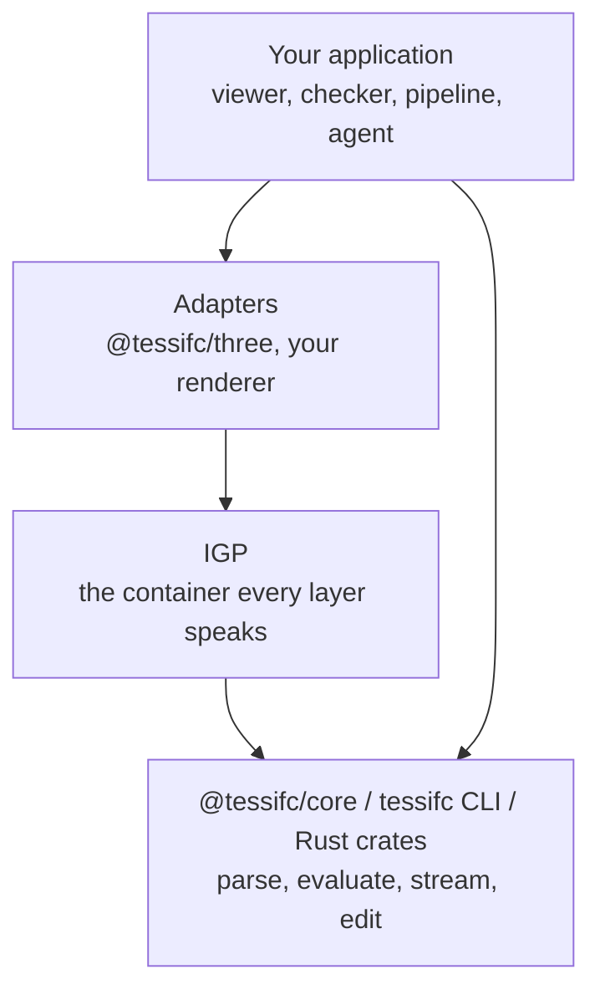

<!-- SPDX-License-Identifier: Apache-2.0 -->
# The TessIFC SDK

The v0.1 developer preview exposes one Rust kernel through native and WASM
interfaces. Start with the [local build](getting-started.md) and read the
[preview contract](preview.md). Registry installation applies after publication.

## Packages

| Package | Registry | What it is | Status |
|---|---|---|---|
| `@tessifc/core` | npm | The WebAssembly kernel and its TypeScript declarations. Browser and Node builds. | preview |
| `@tessifc/three` | npm | Shape arrays to three.js meshes, camera fitting, picking and cleanup. | preview |
| `tessifc-cli` | crates.io | The `tessifc` binary: `info`, `convert`, `edit`, `coverage`. | preview |
| `tessifc-step`, `-schema`, `-model`, `-geom`, `-mesh`, `-pack`, `-engine` | crates.io | The kernel crates, for Rust hosts and for people writing evaluators. | preview |
| the viewer | GitHub Pages | The reference application over `@tessifc/core`. | preview |

All packages are versioned together. A release is one tag and one set of
artefacts on the GitHub Releases page.

## Layers



Two rules keep the layers honest:

* The **kernel never learns about a renderer**. It emits IGP and typed arrays.
  If you need something a renderer needs, the answer is an adapter, not a
  kernel feature.
* **IGP v0 is frozen.** A reader written against `docs/igp-format.md` keeps
  working. Additions arrive as new optional members that old readers ignore.

## Stability

| Surface | Promise |
|---|---|
| `Kernel` methods listed below | Preview API. Pin versions; minor releases may change interfaces. |
| Settings JSON keys | Additive. Unknown keys are ignored, so a newer host talks to an older kernel. |
| IGP v0 layout | Frozen. Changes need a version bump. |
| Diagnostic codes | Stable enums. New codes may appear; existing codes keep their meaning. |
| `tessifc info --json` and `convert --json` | Fields may be added, never renamed or repurposed. |
| Rust crate APIs | Best effort until 1.0. Evaluator traits are the extension point and change last. |

## The Kernel API

`@tessifc/core/web` exports a default `init`, `version`, `initPanicHook` and
the `Kernel` class. The Node build loads synchronously and has no `init`.
One kernel can hold multiple models, each addressed by an integer.
Close models explicitly and call `kernel.free()` when finished with the kernel.

```ts
import init, { Kernel, version } from "@tessifc/core/web";

await init();                 // loads the .wasm next to the module
const kernel = new Kernel();
const id = kernel.openModel(bytes, JSON.stringify({ schemaOverride: "IFC4" }));
// ...
kernel.closeModel(id);
kernel.free();
```

Structured results cross the boundary as JSON strings: parse them. Geometry
crosses as typed arrays, which is the one place the cost is measurable.

### Lifecycle

| Method | Returns | Notes |
|---|---|---|
| `openModel(bytes, settings?)` | model id | Recoverable parse errors become diagnostics; check model info and diagnostics. Invalid settings can throw; resource failures may trap. Settings: `schemaOverride`, `maxEntities`. |
| `closeModel(id)` | boolean | Frees the model and its geometry. |
| `closeAll()` | | |
| `modelCount()` | number | |
| `releaseGeometry(id)` | boolean | Drops evaluated geometry and any stream in progress, keeps the model open for inspection and edits. |

### Inspection

| Method | Returns |
|---|---|
| `getModelInfo(id)` | JSON: `schema`, `schemaDeclared`, `schemaApproximate`, `bytes`, `entities`, `classes` and `products` (counts by class name), `productTotal`, `imageBytes`, `sourceRetainedBytes`, `diagnostics` (`total`, `errors`, `warnings`) and `header`. |
| `getDiagnostics(id)` | Parse diagnostics: JSON array of `{ code, severity, line, expressId, message }`. `expressId` is null when not tied to an instance, and `line` is 0 when unavailable. Geometry diagnostics are in IGP packs. Branch on `code`, not message text. |
| `getClassName(id, expressId)` | the IFC class, or `undefined` for an unknown id. |
| `getProductCategory(id, expressId)` | `physical`, `space`, `opening`, `annotation` or `reference`; `undefined` for a non-product. |
| `getIdsOfType(id, className)` | `Uint32Array` of every instance of the class or its subtypes. |
| `getEntityInfo(id, expressId)` | JSON: attributes by schema name with raw STEP spelling and decoded text. Vendor classes expose numbered arguments. |
| `getSpatialHierarchy(id)` | JSON node list: project, site, building, storey, and every rendered product under its container. |

The kernel report is camelCase; `tessifc info --json` is snake_case. The two
cover most of the same ground, and each carries what only it can see: the CLI
adds the timing and process figures, the kernel adds what it retains in WASM
memory. A host that wants parse timing measures it around `openModel` itself.

### Geometry, whole

`getGeometryCapabilities(id)` returns the schema entity inventory with direct
and inherited evaluator routes. It describes dispatch, not complete coverage.
After evaluation, `getProductOutcomes(id)` returns per-product outcome records.
Read them before `takePack` releases the evaluation. Stream outcomes remain
available while that stream is retained; `cancelGeometryStream(id)` releases it.

```ts
const summary = JSON.parse(kernel.evaluateGeometry(id, JSON.stringify({ includeOpenings: false })));
const outcomes = JSON.parse(kernel.getProductOutcomes(id));
const pack = kernel.takePack(id);    // Uint8Array, IGP v0; releases the evaluation
```

Or per shape, for a host that wants arrays rather than a container:
`shapeCount`, `shapeExpressId`, `shapeClass`, `shapePartCount`, `shapeColor`,
`shapePositions`, `shapeIndices`. Positions are f32 in metres with the model
offset removed; add `summary.modelOffset` back in f64 for world coordinates.

Geometry settings use the same JSON field names and defaults as Rust `Settings`
and CLI `convert --settings '<json>'`. Known fields with the wrong type or out-of-range
values throw at the WASM boundary; unknown fields are ignored for forward compatibility.
Evaluation and stream summaries return `effectiveSettings`.

| Field | Default | Meaning |
|---|---|---|
| `chordToleranceM` | `0.002` | Positive finite chord sagitta in metres |
| `angularToleranceRad` | `Math.PI / 18` | Maximum circle segment angle, in `(0, pi]` |
| `maxCircleSegments` | `512` | Circle budget, from 8 to 4096 |
| `maxSurfaceVertices` | `16384` | Vertex budget per trimmed surface patch, from 64 to 1048576 |
| `circleSegments` | `null` | Optional fixed count, from 3 to `maxCircleSegments` |
| `maxDepth` | `24` | Representation and boolean-chain nesting, from 1 to 128 |
| `weld` | `true` | Weld vertices before closure checks |
| `cutOpenings` | `true` | Subtract related opening geometry |
| `repairPcurveDomains` | `true` | Recover inconsistent parameter scales only after checking the separate 3D curve |
| `repairSurfaceCurves` | `false` | Opt in to diagnosed recovery of inconsistent surface-curve references and edge orientations |
| `includeSpaces` | `true` | Include space and spatial-zone volumes |
| `includeOpenings` | `false` | Include opening and voiding-feature geometry |
| `includeAnnotations` | `false` | Include available annotation and grid geometry |
| `includeReferences` | `false` | Include available port, positioning and analysis geometry |

A segment count or refinement budget can prevent the requested tolerance from being
met. Such output carries `W_TESSELLATION_TOLERANCE_UNMET`; it is not an accuracy
certificate. B-spline and pcurve subdivision refuses the item with
`E_GEOMETRY_LIMIT_REACHED` when its point or depth limit prevents further work.
A recovered pcurve carries `W_PCURVE_DOMAIN_RECOVERED`. Set
`repairPcurveDomains: false` to refuse those repairs.

`repairSurfaceCurves: true` additionally permits three guarded repairs: replacing
an inconsistent pcurve with its 3D reference after checking sampled distances to
the surface; correcting duplicate dehomogenization of rational reference control
points when the resulting path agrees with the surface pcurve and edge vertices;
and reversing an edge whose opposite end continues the preceding edge. These
emit `W_PCURVE_3D_FALLBACK`, `W_PCURVE_REFERENCE_RECOVERED` and
`W_EDGE_ORIENTATION_RECOVERED`, respectively. The source model is unchanged.
Sampled agreement is not proof that an invalid export has been reconstructed
exactly. Strict conversion rejects all of these repairs.

Increasing `maxSurfaceVertices` can admit more detailed patches but increases
memory and work per face. It does not repair invalid topology or guarantee that
the chord tolerance can be met. This is a per-patch limit, not a model-wide budget.

CLI flags `--circle-segments` and `--chord-tolerance-m` override their JSON fields.
`convert --strict` returns failure and does not write the requested pack when
loss or approximation diagnostics are present. Its JSON report says `output_written`.

Every included helper product carries an IGP instance flag. A viewer can keep
the geometry available for inspection while excluding it from its initial
draw, camera bounds, picking and depth-overlap analysis. `getProductCategory`
exposes the same schema-aware classification before or without packing.

### Geometry, streamed

```ts
const plan = JSON.parse(kernel.beginGeometryStream(id, settings));
let chunk;
while ((chunk = kernel.nextGeometryChunk(id, 220, 0, 600_000))) {
  postMessage({ chunk: chunk.buffer }, [chunk.buffer]);       // transfer, do not copy
  const progress = JSON.parse(kernel.streamProgress(id));    // done, total, emitted, triangles, chunks, finished, diagnostic counts
}
```

A chunk stops at whichever limit comes first: milliseconds, products or
triangles, zero meaning no limit, and holds at least one product when products remain. A model with no selected
products still produces one final metadata chunk with its diagnostics. Every
chunk is a valid IGP pack with a `stream` member; the last one carries the
diagnostics and statistics. Geometry ids are global across the stream.

`getProductOutcomes(id)` reports each product as `filtered`, `no_representation`,
`no_usable_representation`, `pending`, `emitted`, or `empty_or_failed`. Read the
diagnostics for the reason; `emitted` means at least one mesh part exists and does
not imply that every requested operation succeeded. Query whole-model outcomes
before `takePack`, or query the retained stream after its final chunk.

`getGeometryCapabilities(id)` lists every entity in the model's schema with its
direct and inherited registry routes. Routes describe dispatch, not conformance.
The native equivalent is `tessifc coverage --inventory`.

`cancelGeometryStream(id)` releases stream caches while keeping the parsed model.
Chunk time limits are checked between products. To interrupt a synchronous product
operation, terminate its worker and open the model in a new worker.

### Geometry, patched

```ts
const patch = kernel.evaluateProducts(id, Uint32Array.from([expressId]), JSON.stringify({
  modelOffset: pack.index.model_offset,
  firstGeometryId: nextFreeGeometryId,
}));
```

Re-evaluates named products into one self-contained final chunk, for
replacing their records after an edit. The caller decides which products an
edit affects; see `docs/editing.md`.

### Editing and export

| Method | Effect |
|---|---|
| `setAttribute(id, expressId, name, value, raw)` | Replace one named attribute and reparse. `raw` means `value` is complete STEP syntax. |
| `setAttributes(id, expressId, editsJson)` | Several attributes as one rewrite and one reparse. Preferred for a form save. |
| `setArgument(id, expressId, index, value, raw)` | By zero-based argument index; the route for vendor classes. |
| `exportModel(id)` | The current source bytes, every untouched byte identical to the input. |

## Reading IGP

You do not need a library. `docs/igp-format.md` ends with a twenty-line
JavaScript reader and a NumPy one. The viewer's `viewer/src/igp.js` is a
complete zero-copy reader you may copy under Apache-2.0, and
`viewer/src/stream.js` shows how to assemble chunks into one pack.

## Running in a worker

The kernel is synchronous and single-threaded by design. Put it in a Web
Worker so parsing and tessellation never block the page, and transfer buffers
in both directions:

```ts
// main thread
const worker = new Worker(new URL("./ifc.worker.js", import.meta.url), { type: "module" });
worker.postMessage({ type: "open", buffer }, [buffer]);
worker.onmessage = ({ data }) => {
  if (data.type === "chunk") scene.append(readIgp(data.buffer));
};

// ifc.worker.js
import init, { Kernel } from "@tessifc/core/web";
await init();
const kernel = new Kernel();
self.onmessage = ({ data }) => {
  if (data.type !== "open") return;
  const id = kernel.openModel(new Uint8Array(data.buffer));
  try {
    kernel.beginGeometryStream(id, "{}");
    let chunk;
    while ((chunk = kernel.nextGeometryChunk(id, 220, 0, 600_000))) {
      self.postMessage({ type: "chunk", buffer: chunk.buffer }, [chunk.buffer]);
    }
    self.postMessage({ type: "done", diagnostics: JSON.parse(kernel.getDiagnostics(id)) });
  } catch (error) {
    self.postMessage({ type: "error", message: String(error) });
  } finally {
    kernel.closeModel(id);
  }
};
```

`viewer/src/worker.js` adds model replacement, edits and export. The example
closes each model after streaming; keep it open if later inspection is needed.
Chunk budgets are checked between products, so one expensive product may
overrun a chunk's time limit. Terminate the worker for a hard cancellation.

## Memory contract

* A `Uint8Array` or typed array returned by the kernel is a copy you own.
  Transfer it, keep it, or drop it; the kernel does not hold it.
* The parsed model lives in WASM linear memory until `closeModel`. The source
  retained for edits and evaluated geometry consume additional memory.
* WASM32 has a 4 GiB address-space ceiling; usable memory can be considerably
  lower. There is no universal safe file-size threshold. Set host limits and
  use the native CLI when browser resources are insufficient.
* Closing models frees allocations for reuse; it does not shrink WASM linear
  memory. Terminating a worker releases its instance and memory.

## Bundlers and hosting

The generated declarations include `Symbol.dispose`. For TypeScript, include
`ESNext.Disposable` alongside your normal libraries, for example
`"lib": ["ES2022", "DOM", "ESNext.Disposable"]`. Use a compiler that provides
that library; the declarations are checked with TypeScript 5.9.

* The package is an ES module plus a `.wasm` file resolved relative to the
  module URL. Vite, webpack 5 and esbuild all handle it; if your bundler
  moves the `.wasm`, pass `init({ module_or_path: wasmUrl })`.
* Content Security Policy must allow your module and worker origins, WASM
  loading and `'wasm-unsafe-eval'`. The local viewer shows a complete policy.
* No cross-origin isolation is required. There is no SharedArrayBuffer and no
  threading in the browser build; parallelism comes from workers you spawn.
* The Node build is CommonJS with the same API, in `pkg-node/`.
* The module is built for speed; `scripts/build-wasm.py --profile wasm-release`
  is the smaller, slower build. Building with one schema feature is smaller
  still; see `bindings/wasm/README.md`.

## Diagnostics as an API

Diagnostics carry a stable code and severity, with an element ID and source
line when available. `E_`, `W_` and `I_` indicate error, warning and information.
They do not independently prove that a product was drawn: inspect the product
outcomes and geometry quality too. Packs carry evaluation diagnostics so a
host can inspect them without reopening the model.

## Integrating into an existing viewer

Add one seam, then put TessIFC behind it:

```ts
interface GeometryBackend {
  load(bytes: Uint8Array, onProgress: (done: number, total: number) => void): Promise<void>;
  onMeshBatch(cb: (batch: { geometryId: number; expressId: number; ifcClass: string;
                           matrix: Float32Array; color: Uint8Array; geometry: BufferGeometry }) => void): void;
  pick(expressId: number): void;
  dispose(): void;
}
```

Implement it once over your current engine and once over `@tessifc/core`,
ship a toggle, and diff the two on the same files.

## Preview feedback

Report missing representations with element IDs, settings and minimal inputs.
New bindings and formats are separate proposals; the supported v0.1 surface
is the package and API set documented above.
