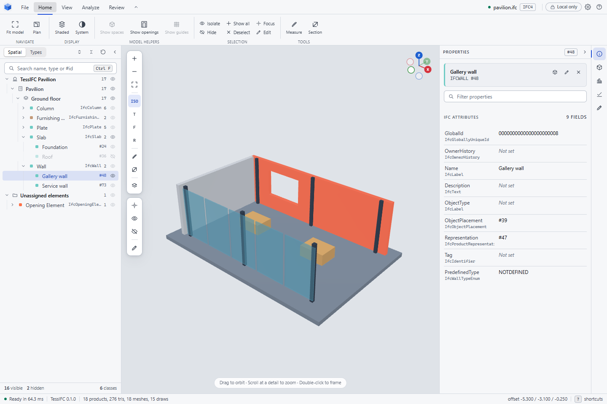

<!-- SPDX-License-Identifier: Apache-2.0 -->
# TessIFC viewer

A browser viewer for IFC files, powered by the [TessIFC](../README.md) geometry
kernel. Open a model to inspect, section, measure and edit it. Files stay in
your browser; nothing is uploaded.

**v0.3 developer preview.** Built with WebAssembly and WebGL2, with no runtime
npm or CDN dependencies.



## What it does

- Browse and search elements by spatial structure, IFC class, name or ID.
- Inspect attributes, hide or isolate elements, and switch display styles.
- Cut live sections and measure between corners, edges and surfaces.
- Edit text attributes and export the IFC while preserving unrelated source.
- Apply externally edited IFC snapshots with **Update IFC**, rebuilding affected
  geometry and retaining unrelated GPU resources.
- Run scripts against the model from the **Session** panel: JavaScript in the
  browser, on a local `tessifc-mcp` host, or Python with IfcOpenShell through
  a local session. A browser script that runs past the limit in **Settings**
  is stopped and the model reopens at its last revision. Ask an assistant to
  explain the model or propose edits, or watch an agent connected over MCP
  build one from nothing.

Reads IFC2X3, IFC4 and IFC4X3. Geometry support varies by representation; see
[geometry coverage](../docs/coverage.md) and the [preview contract](../docs/preview.md).

The renderer itself is the [`@tessifc/viewer`](../bindings/viewer/README.md)
package; this application is its ribbon, panels and tree. To embed a viewer
in your own page, start there.

## Run locally

Requires Rust via rustup, Python 3.11+ and a browser with WebGL2 support.
Run from the repository root:

```sh
rustup target add wasm32-unknown-unknown
python scripts/build-wasm.py --target web
python -m http.server 8000 --bind 127.0.0.1
```

If `wasm-bindgen-cli` is missing or mismatched, the build script prints the
installation command. See [getting started](../docs/getting-started.md) for details.

Open <http://127.0.0.1:8000/viewer/> and drop an `.ifc` file onto the page.
Serve the repository root so the viewer can load `bindings/wasm/pkg/`.

For scripted or assisted editing, follow the
[incremental editing example](../examples/incremental-edit/README.md): the
Session panel's examples add a door, raise or move the selection, build a
small house and more, straight in the browser. A local Python session runs
IfcOpenShell scripts and picks up saved revisions from any process, and
`node bindings/mcp/src/cli.js --new house.ifc` serves an empty model that an
agent fills while this page follows at the address the server prints
(`?session=file#token=...`); see the
[agent-building example](../examples/agent-building/README.md). Geometry
updates preserve the camera and valid selection; changes with global effects
use a full rebuild. See [editing](../docs/editing.md) for the revision and
recovery boundaries.

## Controls

Left-drag to orbit, right-drag or Shift-drag to pan, and scroll to zoom.
Clicking an element selects it and moves the orbit and zoom centre to the
surface you clicked, so scrolling afterwards takes you into that element
however far the model's bounds extend. Double-click an element to frame it.
While you move the view from inside a model, groups of products entirely
behind its largest walls and slabs are left out of the frame and drawn again
the moment you stop (**Skip hidden geometry while moving** in Settings).
Large meshes are simplified in the background once a model is on screen and
the simpler version is drawn while you move; the frame at rest always shows
the full detail (**Coarser meshes while moving** in Settings).
**Show textures** in Settings reads the file's surface textures for files
opened afterwards and paints them on the products that carry texture
coordinates; images referenced by path load only from the page's own origin.
On touch screens, use one finger to orbit and two fingers to pan or pinch to
zoom. The dock on the left of the viewport keeps zoom, fit, the standard
views, measure, section, display style and **Show all** one click away; a dot
on Show all means something is hidden or isolated, and pressing it brings
those elements back while spaces, openings and guides keep their own
toggles on the View tab.

The right side shows one panel at a time: the edit panel and the Session
panel take the inspector's place and hand it back when they close.

| Key | Action |
| --- | --- |
| `F` / `Shift F` | Frame model / selection |
| `1` `2` `3` `4` | Front, right, top, isometric |
| `M` / `X` / `P` | Measure / section plane / plan view |
| `I` / `H` / `A` | Isolate / hide / show all |
| `E` | Toggle the attribute editor |
| `Ctrl Enter` | Run the session script |
| `Ctrl O` / `Ctrl S` | Open IFC / export IFC |
| `Ctrl K` / `?` | Command palette / all shortcuts |

## Tests

Requires Node 20+. From the repository root:

```sh
python scripts/build-wasm.py --target both
npm ci
npx playwright install chromium
npm --prefix viewer test
```

Runs unit tests and browser rendering checks. Set
`TESSIFC_BROWSER_CHANNEL=chrome` to use an installed Chrome.

## Licence

Apache-2.0. See [LICENSE](../LICENSE) and [NOTICE](../NOTICE).
